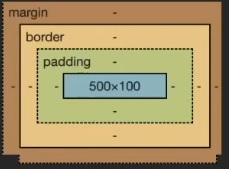

# CSS - CASCADING STYLE SHEETS
Lenguaje de diseño, de estilado, lenguaje declarativo para describir la presentación de un documento.
Las hojas de estilo (style sheets), son un conjunto de reglas que escribimos en el "lenguaje" y aplicamos a un documento para mejorar la vista del documento.
Repecto a la "cascada" se refiere a como se aplican las reglas al documento, ya que se aplican en un orden en específico.

En el header podemos enlazar el archivo de `css` que tiene la extensión de `.css` o también se pueden incluir los estilos dentro del documento.
Por otro lado también podemos incluir estilos en línea con el atributo `style`. 

Un documento que no tenga estilado nada, sigue teniendo estilos por defecto esto se llama `USER AGENT STYLESHEET`.

```html
<!DOCTYPE html>
<html>
    <head>
        <!-- Metadatos -->
        <link href="style.css" rel="stylesheet" type="text/css" />
        <style type="text/css">
            selector { /* El contenido de las llaves son los estilos que le queremos poner a lo seleccionado */
                propiedad: valor; /* Esta línea es una declaración */
            }

            body {
                background: #09f;
            }
        </style>
    </head>
    <body>
        <!-- Contenido aquí -->
    </body>
</html>
```


## Selectores

### Selector universal
Toma todos los elementos del documento
```css
* {
    font-family: Verdana, Geneva;
}
```

### Selector de etiqueta
Selecciona por la propia etiqueta HTML, si aparece solo, hace referencia a TODAS las etiquetas.

```css
h1 {
    background: red;
    /*color: rgba(0, 0, 0, 50%); <----- legacy */
    color: rgb(0 0 0 / 50%);
    color: hsl(60, 83%, 20%); /* matiz, saturación, luminosidad*/
    color: oklch(60, 83%, 20% / 50%); /* ligthness, chroma, alpha, hue */
    color: transparent;
    color: #09f; /* #0099ff */
    color: #0099ff50; /* Con 8 caráteres lo que pones al final es la transparencia */

    border-width: 3px;
    border-style: solid;
    border-color: currentColor; /* Esto coge el valor del color que tiene actualmente el texto.*/

}

footer a {
    /* selecciona los enlaces del footer */
}
```

### Selector de identificador
Se utiliza el atributo `id` para darle un valor único al elemento. No es recomendable utilizar para las clases este tipo de selector. Ya que el CSS siempre suele hacer refencia a varios elementos. Y cada atributo `id` debe ser único y monta un acceso en el DOM (Teniendo un coste en rendimiento).

```css
<div id="description"></div>

#description {
    border 1px solid black;
}

#titulo, #description {
    border 1px solid black;
}

#usuario form {
    border: 5px solid blue;
}

#usuario form * {
    display: block;
}
```

### Selector de clase
```css
<p class="parrafo"></p>

.parrafo {
    font-style: italic;
}
```

### Selector combinado
```css
<p class="parrafo"></p>

.parrafo .texto {
    font-style: italic;
}
```

### Selector de atributo
```css
input[type="text"] {
    width: 200px;
}

input[type="submit"] {
    width: 200px;
}
```

### Selector hijo
```css
/*Se le pone a los elementos después del selector */
#menu > li > a {
    color: red;
}
```

### Selector next operator
```css
/*Se le pone a los elementos después del selector */
p ~ span { /* todos los elementos después de la p los estilas*/
    color: red;
}

p + span { /* SOLO el elemento después de la p lo estila*/
    color: red;
}
```

## Herencia
Algunas propiedades de CSS se heredan, de la capa superior que envuelve al elemento. Como puede ser por ejemplo la fuente y el color.
No todas las propiedades son heredables, por que no tienen sentido, por ejemplo imagínate heredar un borde.
Pero se puede hacer diferentes cosas con la herencia en las propiedades a traves de diferentes valores:

-`inherit`: Puede forzar la herencia del padre.
-`initial`: Reinicia a las especificaciones por defecto de CSS.
-`unset`: Resetear el valor.
-`revert`: Revertir el valor de la herencia, salvo que exista un valor por defecto en el navegador (Si tiene un valor por defecto como `inherit` es el que toma).

```css
    body {
        background: #dbfbff;
        font-family: system-ui-, --apple-system, sans-serif;
        /* En esta lista no se van a usar todas, se usa la primera y el resto son fallbacks */
        border: inherit; /* Por defecto border no tiene inherit, tiene initial, por que evita heredar el valor, pero podemos forzar a que lo tenga */
    }
```

## Pseudoclases
Hay elementos de HTML que tienen estados especiales y vamos a querer controlar el estilo en ese momento. Por ejemplo en un enlace, cuando se pase el ratón por encima queremos cambiar como se ve el enlace. Esto mismo es una pseudoclase.
Estos elementos se pueden emular en las herramientas de desarrollador, suele aparecer marcado con `:hov`.
```css
    a:hover{
        color: red;
        border: 3px solid red; /* Esto se dibuja alrededor del elemento, provocando un cambio en los tamaños */ /* Esto es un borde */
        outline: 3px solid red; /* Esto se dibuja POR ENCIMA de todo, sin causar cambio en el resto de elementos */ /* Esto es un contorno */
    }

    a:active { /* cuando un elemento recibe el click */
        color: blue;
    }

    input:focus { /* cuando un elemento recibe el click */
        border: 1px solid red;
    }

    li:first-child { /* para que esto solo lo reciba el primer hijo */
        border: 1px solid red;
    }

    li:last-child { /* para que esto solo lo reciba el último hijo */
        border: 1px solid red;
    }
```

## Cascada
La "cascada" en CSS se refiere al proceso mediante el cual se aplican estilos a los elementos de una página web según un conjunto de reglas específicas. Este proceso se denomina "cascada" porque los estilos se aplican en cascada, lo que significa que pueden ser sobrescritos o heredados según su especificidad y su posición en la hoja de estilos.

Cuando un navegador interpreta un documento HTML, también interpreta cualquier hoja de estilos asociada (ya sea en línea, incrustada o externa). Durante este proceso, se aplican los estilos a los elementos HTML siguiendo estas reglas:

    - Especificidad: Las reglas con mayor especificidad tienen prioridad sobre las reglas con menor especificidad. Por ejemplo, un selector con un id tiene mayor especificidad que un selector con una clase, y un selector con una clase tiene mayor especificidad que un selector con un elemento.

    - Orden: Las reglas que aparecen más tarde en la hoja de estilos tienen prioridad sobre las que aparecen antes. Esto significa que si dos reglas tienen la misma especificidad, la que aparezca más tarde en la hoja de estilos será la que prevalezca.

    - Heredabilidad: Algunos estilos se heredan de los elementos padres a los elementos hijos. Esto significa que si no se especifica un estilo para un elemento hijo, puede heredar el estilo de su elemento padre.

El proceso de cascada en CSS permite una gran flexibilidad y control sobre el aspecto y el diseño de una página web al permitir que los estilos se apliquen y modifiquen de manera selectiva y ordenada. Sin embargo, también puede ser complejo y puede requerir un entendimiento detallado de cómo funcionan las reglas de especificidad y cómo se aplican los estilos en diferentes situaciones.


```css
    p {
        color: red;
    }

    p {
        color: blue; /* Esto hace que el color sea azul, por lo tanto sobreescribe el color rojo de arriba  */
        color: oklch(70% 0.148 238.24); /* Pero este valor de poner los colores no es compatible con todos los navegadores, por lo tanto si no es compatible el color que se mostrará sera el rojo (Si obiamos el azul de arriba). Esto es una manera de hacer fallback en CSS. */
    }
```

### Especificidad
CSS tiene un algoritmo que determina a traves de un peso el selector que tiene la coincidencia más fuerte. Es decir va a calcular cuanto es de específico es el selector que se ha puesto y va a escojer el más específico. El algoritmo es un selector de tres pasos `X.Y.Z`.
[Calculador de especificidad](https://specificity.keegan.st/)
El estilo con más especificidad es el estilo escrito en línea, y el que menos es el del `USER AGENT STYLESHEET`.
Esto es una de las cosas más difíciles de dominar en CSS. Pero hay espeficicaciones que te ayudan a evitar esto [getbem](https://getbem.com/). O frameworks como Tailwind para evitar todo esto. 

La forma más fácil de saltarse la especificidad es poner la palabra clave `!important`. Pero de la misma manera el `!important` puede tener un empate con otro.

De todas maneras en las herramientas de desarrollo si se deja el ratón encima del selector te enseña la especificidad.

```css
    <article class="text">Texto</article>

    .text {
        color: red; /* En este caso el color que perdura es el rojo, ya que es el que más peso tiene, el más específico para este caso */
    }

    p {
        color: blue; 
    }
```

## Unidades relativas y absolutas
Por norma general la unidad que se suele usar en los elementos para darle un tamaño es el pixel `px`, y antes esto era una medida absoluta. Pero actualmente esto ya no es así ya que 1 pixel dentro de la "web" no es un pixel en la "pantalla" ya que no es lo mismo una pantalla 4k, 2k, o 1080. Por lo tanto si que es relativo a la densidad de pixeles donde queremos renderizar el contenido. A día de hoy técnicamente se sigue considerando una unidad absoluta. Pero es por que en un inicio lo fue, en la práctica real no lo es.

Otra unidad relativa es el `%`, que toma el porcentaje dado del contenedor padre. En caso de el `height` en caso de que el contendor padre no tenga un tamaño asignado es el tamaño del contenido.

```css
    <div class="container">Texto</div>

    .container {
        width: 50%;
        height: 50%;
        background: red;
    }

    p {
        color: #09f; 
    }
```

Una medida que podemos usar en función de lo que estamos viendo es el `viewport`. El viewport en CSS se refiere al área visible de una página web en el navegador. En términos simples, es el área de la ventana del navegador en la que se muestra el contenido de la página. El tamaño del viewport puede variar dependiendo del dispositivo y del tamaño de la ventana del navegador.

```css
    <div class="container">Texto</div>

    .container {
        width: 50vw;
        height: 50vh;
        background: red;
    }

    p {
        color: #09f; 
    }
```

## Modelo de la caja vs mnodelo en línea

El "modelo de la caja" y el concepto de "en línea" son dos formas diferentes de representar el flujo y el comportamiento de los elementos en una página web en HTML y CSS.

Modelo de la caja: `div`
    Se aplica a elementos de bloque (`display: block`) y define cada elemento como una caja rectangular que contiene contenido, relleno, borde y margen.
    Los elementos de bloque ocupan todo el ancho disponible en su contenedor y *comienzan en una nueva línea*, lo que significa que ocupan su propio espacio en el diseño de la página y no se superponen con otros elementos de bloque.

En línea: `span`
    Se aplica a elementos en línea (`display: inline`) y se comportan de manera diferente a los elementos de bloque.
    Los elementos en línea ocupan solo el espacio necesario para mostrar su contenido y *no inician una nueva línea*. Varios elementos en línea pueden aparecer en la misma línea si tienen suficiente espacio disponible en el contenedor. Estos elementos no tienen alto ni ancho.
    Ejemplos comunes de elementos en línea son `span`, a, `strong`, `em`, `img`, entre otros.
    Las propiedades de tamaño como `width` y `height` no se aplican a los elementos en línea, aunque se pueden aplicar otras propiedades como `padding`, `border`, `margin`, etc.

En resumen, el modelo de la caja se refiere a cómo se representan y se controlan los elementos de bloque en una página web, mientras que "en línea" se refiere a cómo se representan y se comportan los elementos en línea.

```css
    <span>Esto es un texto</span>

    span {
        background: red;
        width: 500px; /* Esto no funciona por que es un elemento de tipo lína, y por mucho que lo intentemos se va a comportar como texto.*/
        height: 500px !important; /* Evidentemente esto tampoco funciona */
    }
```

### Margin - Border - Padding



Las diferencias entre `margin`, `border` y `padding` son fundamentales en el modelo de caja de CSS y se refieren a diferentes áreas alrededor del contenido de un elemento. Estas son las distinciones clave:

Margin (Margen):
    `margin` controla el espacio entre el borde del elemento y los elementos adyacentes.
    Define el espacio externo alrededor de la caja del elemento.
    No afecta el tamaño del elemento en sí, solo el espacio entre el elemento y otros elementos adyacentes.
    Se utiliza para controlar el espacio entre elementos en el diseño de la página.

Border (Borde):
    `border` define el borde alrededor del contenido y el relleno del elemento.
    Se coloca justo después del relleno y antes del margen.
    Puede tener un ancho, un estilo (como sólido, punteado, etc.) y un color definido.
    Define el límite exterior del elemento.

Padding (Relleno):
    `padding` controla el espacio entre el contenido del elemento y su borde.
    Define el espacio interno alrededor del contenido de la caja.
    Afecta al tamaño del elemento, ya que aumenta o disminuye el espacio disponible para el contenido dentro de la caja.
    Se utiliza para agregar espacio entre el contenido y el borde del elemento.

En resumen, mientras que margin controla el espacio fuera del elemento, border define el límite del elemento y padding controla el espacio entre el contenido del elemento y su borde. Estos tres componentes son esenciales para el diseño y la estructura de una página web en CSS, ya que permiten controlar el espacio y el diseño alrededor de los elementos HTML.


Recursos:

[lenguajecss.com/css/](https://lenguajecss.com/css/)
[Curso de google de CSS](https://web.dev/learn/css?hl=es)
[MDN WEB DOCS CSS](https://developer.mozilla.org/es/docs/Web/CSS)