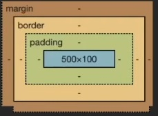

# CSS - CASCADING STYLE SHEETS

# [CHEATSHEET](https://quickref.me/css3)

Lenguaje de diseño, de estilado, lenguaje declarativo para describir la presentación de un documento.
Las hojas de estilo (style sheets), son un conjunto de reglas que escribimos en el "lenguaje" y aplicamos a un documento para mejorar la vista del documento.
Repecto a la "cascada" se refiere a como se aplican las reglas al documento, ya que se aplican en un orden en específico.

En el header podemos enlazar el archivo de `css` que tiene la extensión de `.css` o también se pueden incluir los estilos dentro del documento.
Por otro lado también podemos incluir estilos en línea con el atributo `style`.

Un documento que no tenga estilado nada, sigue teniendo estilos por defecto, esto se llama `USER AGENT STYLESHEET`.

```html
<!DOCTYPE html>
<html>
    <head>
        <!-- Metadatos -->
        <link href="style.css" rel="stylesheet" type="text/css" />
        <style type="text/css">
            selector {
                /* El contenido de las llaves son los estilos que le queremos poner a lo seleccionado */
                propiedad: valor; /* Esta línea es una declaración */
            }

            body {
                background: #09f;
            }
        </style>
    </head>
    <body>
        <!-- Contenido aquí -->
    </body>
</html>
```

## [Selectores](https://frontend30.com/css-selectors-cheatsheet/)

### Selector universal

Toma todos los elementos del documento

```css
* {
    font-family: Verdana, Geneva;
}
```

### Selector de etiqueta

Selecciona por la propia etiqueta HTML, si aparece solo, hace referencia a TODAS las etiquetas.

```css
h1 {
    background: red;
    /*color: rgba(0, 0, 0, 50%); <----- legacy */
    color: rgb(0 0 0 / 50%);
    color: hsl(60, 83%, 20%); /* matiz, saturación, luminosidad*/
    color: oklch(60, 83%, 20% / 50%); /* ligthness, chroma, alpha, hue */
    color: transparent;
    color: #09f; /* #0099ff */
    color: #0099ff50; /* Con 8 caráteres lo que pones al final es la transparencia */

    border-width: 3px;
    border-style: solid;
    border-color: currentColor; /* Esto coge el valor del color que tiene actualmente el texto.*/
}

footer a {
    /* selecciona los enlaces del footer */
}
```

### Selector de identificador

Se utiliza el atributo `id` para darle un valor único al elemento. No es recomendable utilizar para las clases este tipo de selector. Ya que el CSS siempre suele hacer refencia a varios elementos. Y cada atributo `id` debe ser único y monta un acceso en el DOM (Teniendo un coste en rendimiento).

```html
<div id="description"></div>
<style type="text/css">
    #description {
        border 1px solid black;
    }

    #titulo, #description {
        border 1px solid black;
    }

    #usuario form {
        border: 5px solid blue;
    }

    #usuario form * {
        display: block;
    }
</style>
```

### Selector de clase

```html
<p class="parrafo"></p>

<style type="text/css">
    .parrafo {
        font-style: italic;
    }
</style>
```

### Selector combinado

```html
<p class="parrafo"></p>

<style type="text/css">
    .parrafo .texto {
        font-style: italic;
    }
</style>
```

### Selector de atributo

```css
input[type='text'] {
    width: 200px;
}

input[type='submit'] {
    width: 200px;
}
```

### Selector hijo

```css
/*Se le pone a los elementos después del selector */
#menu > li > a {
    color: red;
}
```

### Selector next operator

```css
/*Se le pone a los elementos después del selector */
p ~ span {
    /* todos los elementos después de la p los estilas*/
    color: red;
}

p + span {
    /* SOLO el elemento después de la p lo estila*/
    color: red;
}
```

## Herencia

Algunas propiedades de CSS se heredan, de la capa superior que envuelve al elemento. Como puede ser por ejemplo la fuente y el color.
No todas las propiedades son heredables, por que no tienen sentido, por ejemplo heredar un borde.
Pero se pueden hacer diferentes cosas con la herencia en las propiedades a través de diferentes valores:

-   `inherit`: Puede forzar la herencia del padre.
-   `initial`: Reinicia a las especificaciones por defecto de CSS.
-   `unset`: Resetea el valor.
-   `revert`: Revertir el valor de la herencia, salvo que exista un valor por defecto en el navegador (Si tiene un valor por defecto como `inherit` es el que toma).

```css
body {
    background: #dbfbff;
    font-family: system-ui-, --apple-system, sans-serif;
    /* En esta lista no se van a usar todas, se usa la primera y el resto son fallbacks */
    border: inherit; /* Por defecto border no tiene inherit, tiene initial, por que evita heredar el valor, pero podemos forzar a que lo tenga */
}
```

## Pseudoclases

Hay elementos de HTML que tienen estados especiales y vamos a querer controlar el estilo en ese momento. Por ejemplo, en un enlace, cuando se pase el ratón por encima queremos cambiar como se ve el enlace. Esto mismo es una pseudoclase.
Estos elementos se pueden emular en las herramientas de desarrollador, suele aparecer marcado con `:hov`.

```css
a:hover {
    color: red;
    border: 3px solid red; /* Esto se dibuja alrededor del elemento, provocando un cambio en los tamaños */ /* Esto es un borde */
    outline: 3px solid red; /* Esto se dibuja POR ENCIMA de todo, sin causar cambio en el resto de elementos */ /* Esto es un contorno */
}

a:active {
    /* cuando un elemento recibe el click */
    color: blue;
}

input:focus {
    /* cuando un elemento recibe el click */
    border: 1px solid red;
}

li:first-child {
    /* para que esto solo lo reciba el primer hijo */
    border: 1px solid red;
}

li:last-child {
    /* para que esto solo lo reciba el último hijo */
    border: 1px solid red;
}
```

## [Nesting](https://developer.mozilla.org/en-US/docs/Web/CSS/CSS_nesting)

El "anidamiento" es una característica que permite escribir estilos de una manera más estructurada y organizada, alineada con la estructura del HTML que están estilizando.

### Sintaxis básica:

Puedes anidar selectores dentro de otros selectores para aplicar estilos a elementos que están anidados dentro de otros elementos. La sintaxis es similar a la estructura del HTML.

```css
selector-padre {
    propiedad: valor;

    selector-hijo {
        propiedad: valor;
    }
}
```

```css
/* Anidamiento básico */
.navbar {
    background-color: #333;

    .menu {
        padding: 10px;
    }

    .menu-item {
        color: white;
    }

    &:hover {
        cursor: progress;
    }
}
```

-   **Estructura clara y organizada:** El anidamiento facilita la lectura y comprensión del código CSS, ya que refleja la estructura del HTML.
-   **Evita la repetición:** Permite escribir selectores más cortos y legibles, evitando la repetición de nombres de clases.

## Cascada

La "cascada" en CSS se refiere al proceso mediante el cual se aplican estilos a los elementos de una página web según un conjunto de reglas específicas. Este proceso se denomina "cascada" porque los estilos se aplican en cascada, lo que significa que pueden ser sobrescritos o heredados según su especificidad y su posición en la hoja de estilos.

Cuando un navegador interpreta un documento HTML, también interpreta cualquier hoja de estilos asociada (ya sea en línea, incrustada o externa). Durante este proceso, se aplican los estilos a los elementos HTML siguiendo estas reglas:

-   Especificidad: Las reglas con mayor especificidad tienen prioridad sobre las reglas con menor especificidad. Por ejemplo, un selector con un id tiene mayor especificidad que un selector con una clase, y un selector con una clase tiene mayor especificidad que un selector con un elemento.

-   Orden: Las reglas que aparecen más tarde en la hoja de estilos tienen prioridad sobre las que aparecen antes. Esto significa que si dos reglas tienen la misma especificidad, la que aparezca más tarde en la hoja de estilos será la que prevalezca.

-   Heredabilidad: Algunos estilos se heredan de los elementos padres a los elementos hijos. Esto significa que si no se especifica un estilo para un elemento hijo, puede heredar el estilo de su elemento padre.

El proceso de cascada en CSS permite una gran flexibilidad y control sobre el aspecto y el diseño de una página web al permitir que los estilos se apliquen y modifiquen de manera selectiva y ordenada. Sin embargo, también puede ser complejo y puede requerir un entendimiento detallado de cómo funcionan las reglas de especificidad y cómo se aplican los estilos en diferentes situaciones.

```css
p {
    color: red;
}

p {
    color: blue; /* Esto hace que el color sea azul, por lo tanto sobreescribe el color rojo de arriba  */
    color: oklch(
        70% 0.148 238.24
    ); /* Pero este valor de poner los colores no es compatible con todos los navegadores, por lo tanto si no es compatible el color que se mostrará sera el rojo (Si obiamos el azul de arriba). Esto es una manera de hacer fallback en CSS. */
}
```

### Especificidad

CSS tiene un algoritmo que determina a traves de un peso el selector que tiene la coincidencia más fuerte. Es decir va a calcular cuanto es de específico es el selector que se ha puesto y va a escojer el más específico. El algoritmo es un selector de tres pasos `X.Y.Z`.
[Calculador de especificidad](https://specificity.keegan.st/)
El estilo con más especificidad es el estilo escrito en línea, y el que menos es el del `USER AGENT STYLESHEET`.
Esto es una de las cosas más difíciles de dominar en CSS. Pero hay espeficicaciones que te ayudan a evitar esto: [getbem](https://getbem.com/). O frameworks como Tailwind para evitar todo esto.

La forma más fácil de saltarse la especificidad es poner la palabra clave `!important`. Pero de la misma manera el `!important` puede tener un empate con otro.

De todas maneras en las herramientas de desarrollo si se deja el ratón encima del selector te enseña la especificidad.

```html
<article class="text">Texto</article>

<style type="text/css">
    .text {
        color: red; /* En este caso el color que perdura es el rojo, ya que es el que más peso tiene, el más específico para este caso */
    }

    p {
        color: blue;
    }
</style>
```

## Unidades relativas y absolutas

Por norma general la unidad que se suele usar en los elementos para darle un tamaño es el pixel `px`, y antes esto era una medida absoluta. Pero actualmente esto ya no es así ya que 1 pixel dentro de la "web" no es un pixel en la "pantalla" ya que no es lo mismo una pantalla 4k, 2k, o 1080. Por lo tanto si que es relativo a la densidad de pixeles donde queremos renderizar el contenido. A día de hoy técnicamente se sigue considerando una unidad absoluta. Pero es por que en un inicio lo fue, en la práctica real no lo es.

Otra unidad relativa es el `%`, que toma el porcentaje dado del contenedor padre. En caso de el `height` en caso de que el contendor padre no tenga un tamaño asignado es el tamaño del contenido.

```html
<div class="container">Texto</div>

<style type="text/css">
    .container {
        width: 50%;
        height: 50%;
        background: red;
    }

    p {
        color: #09f;
    }
</style>
```

Una medida que podemos usar en función de lo que estamos viendo es el `viewport`. El viewport en CSS se refiere al área visible de una página web en el navegador. En términos simples, es el área de la ventana del navegador en la que se muestra el contenido de la página. El tamaño del viewport puede variar dependiendo del dispositivo y del tamaño de la ventana del navegador.

```html
<div class="container">Texto</div>

<style type="text/css">
    .container {
        width: 50vw;
        height: 50vh;
        background: red;
    }

    p {
        color: #09f;
    }
</style>
```

## Modelo de la caja vs modelo en línea

El "modelo de la caja" y el concepto de "en línea" son dos formas diferentes de representar el flujo y el comportamiento de los elementos en una página web en HTML y CSS.

Modelo de la caja: `div`
Se aplica a elementos de bloque (`display: block`) y define cada elemento como una caja rectangular que contiene contenido, relleno, borde y margen.
Los elementos de bloque ocupan todo el ancho disponible en su contenedor y _comienzan en una nueva línea_, lo que significa que ocupan su propio espacio en el diseño de la página y no se superponen con otros elementos de bloque.

En línea: `span`
Se aplica a elementos en línea (`display: inline`) y se comportan de manera diferente a los elementos de bloque.
Los elementos en línea ocupan solo el espacio necesario para mostrar su contenido y _no inician una nueva línea_. Varios elementos en línea pueden aparecer en la misma línea si tienen suficiente espacio disponible en el contenedor. Estos elementos no tienen alto ni ancho.
Ejemplos comunes de elementos en línea son `span`, a, `strong`, `em`, `img`, entre otros.
Las propiedades de tamaño como `width` y `height` no se aplican a los elementos en línea, aunque se pueden aplicar otras propiedades como `padding`, `border`, `margin`, etc.

En resumen, el modelo de la caja se refiere a cómo se representan y se controlan los elementos de bloque en una página web, mientras que "en línea" se refiere a cómo se representan y se comportan los elementos en línea.

```html
<span>Esto es un texto</span>

<style type="text/css">
    span {
        background: red;
        width: 500px; /* Esto no funciona por que es un elemento de tipo lína, y por mucho que lo intentemos se va a comportar como texto.*/
        height: 500px !important; /* Evidentemente esto tampoco funciona */
    }
</style>
```

### Margin - Border - Padding



Las diferencias entre `margin`, `border` y `padding` son fundamentales en el modelo de caja de CSS y se refieren a diferentes áreas alrededor del contenido de un elemento. Estas son las distinciones clave:

Margin (Margen):
`margin` controla el espacio entre el borde del elemento y los elementos adyacentes.
Define el espacio externo alrededor de la caja del elemento.
No afecta el tamaño del elemento en sí, solo el espacio entre el elemento y otros elementos adyacentes.
Se utiliza para controlar el espacio entre elementos en el diseño de la página.

Border (Borde):
`border` define el borde alrededor del contenido y el relleno del elemento.
Se coloca justo después del relleno y antes del margen.
Puede tener un ancho, un estilo (como sólido, punteado, etc.) y un color definido.
Define el límite exterior del elemento.

Padding (Relleno):
`padding` controla el espacio entre el contenido del elemento y su borde.
Define el espacio interno alrededor del contenido de la caja.
Afecta al tamaño del elemento, ya que aumenta o disminuye el espacio disponible para el contenido dentro de la caja.
Se utiliza para agregar espacio entre el contenido y el borde del elemento.

En resumen, mientras que margin controla el espacio fuera del elemento, border define el límite del elemento y padding controla el espacio entre el contenido del elemento y su borde. Estos tres componentes son esenciales para el diseño y la estructura de una página web en CSS, ya que permiten controlar el espacio y el diseño alrededor de los elementos HTML.

Una cosa a tener en cuenta es que cuando se le da un tamaño a una caja, no se tiene en cuenta ni el borde ni el margen, por lo tanto el valor al final va a ser el valor introducido + borde + margen. Esto es por que por defecto la propiedad de `box-sizing` viene con el valor de `content-box`, si le ponemos el valor de `border-box` el valor que le pongamos en el `width` o en el `heigth` será el valor que tendrá al final la caja teniendo en cuenta el borde y el margen.

## Overflow


La propiedad CSS overflow se utiliza para controlar cómo se maneja el contenido que desborda el área del contenedor en el que está contenido. En otras palabras, determina qué sucede cuando el contenido es más grande que el área visible de un elemento.

Existen varias opciones para la propiedad overflow:

-   `visible`: Es el **valor predeterminado**. El contenido que desborda el área del contenedor será visible fuera de los límites del contenedor, lo que significa que sobresaldrá del contenedor.

-   `hidden`: Cualquier contenido que desborde el área del contenedor será cortado y no será visible fuera de los límites del contenedor. Esto significa que el contenido recortado no será visible para el usuario.

-   `scroll`: Se mostrarán barras de desplazamiento (tanto horizontales como verticales) para permitir al usuario desplazarse por el contenido que desborda el área del contenedor. Aunque el contenido desbordado está disponible, puede que no sea visible sin usar las barras de desplazamiento.

-   `auto`: Este valor es similar a scroll, pero solo se muestran las barras de desplazamiento cuando es necesario. Si el contenido no desborda el contenedor, no se mostrarán barras de desplazamiento.

-   `inherit`: Hereda el comportamiento de desbordamiento de su elemento padre.

La propiedad overflow es útil para manejar situaciones en las que el contenido de un elemento es demasiado grande para caber en su contenedor, permitiendo al diseñador controlar cómo se maneja y muestra el contenido excedente.

Evidentemente esto se puede combinar con diferentes técnicas, si tienes un cuadro de texto con `overflow: hidden;`, siempre puedes combinarlo con un `text-overflow: ellipsis;` para que el desbordamiento acabe con `...`. El valor por defecto del `text-overflow` es `clip`.

## Position

La propiedad position se utiliza para controlar el método de posicionamiento de un elemento en relación con su contenedor o elementos adyacentes. La propiedad position tiene varios valores posibles que determinan cómo se coloca un elemento en la página.

Aquí están los valores posibles para la propiedad position:

-   `static`: Es el valor predeterminado para todos los elementos. Los elementos con posición estática **se colocan en el flujo normal del documento**. Es decir, se colocan en el orden en que aparecen en el HTML, uno debajo del otro.

-   `relative`: Coloca el elemento en relación con su posición original. Permite desplazar el elemento de su posición original utilizando las propiedades top, right, bottom y left. Esto no afecta la posición de los otros elementos.

-   `absolute`: Posiciona el elemento en relación con su primer ancestro posicionado (elemento padre que tiene un valor de posición diferente a static) o en relación con el elemento de nivel superior (<html>). No deja espacio vacío para el elemento en el flujo normal del documento, por lo que puede superponerse a otros elementos. Cuando ponemos una propiedad que tiene el valor de `absolute`, podemos poner otros atributos (`top`, `rigth`, `left`, `bottom`) que son como unas coordenadas que toman por valor el tamaño del documento (la ventana). Para que estos valores estén dentro del contenedor padre, el contenedor padre debe tener la propiedad de `position: relative;`. Con esto creamos un punto relativo, el cual todos los hijos lo pueden usar como referencia. Con la posición de `absolute`, se podría llegar a centrar un contendor, con `top: 0;`, `bottom: 0;`, `left: 0:`, `rigth: 0;`, `margin: auto;`, ya que detecta que tiene que tener la misma distancia por todos los sitios, con el `margin: auto;` se acaba de centrar. La forma acortada de hacer esto es con `inset: 0;` y con el margen. Esto funciona muy bien para modales, dialogos, pero no es la forma más correcta de centar un `div`.

-   `fixed`: Posiciona el elemento en **relación con la ventana del navegador, independientemente del desplazamiento**. Se mantiene fijo en su posición incluso cuando el usuario desplaza la página. El elemento fixed es fijo en el viewport. Y no le afecta el `position: relative;`.

-   `sticky`: Actúa como relative **hasta que el elemento alcanza una cierta posición de desplazamiento** (definida por las propiedades `top`, `right`, `bottom` o `left`), momento en el que se comporta como fixed en relación con su contenedor más cercano con una propiedad de overflow que no sea visible.

## [Contexto de apilamiento](https://developer.mozilla.org/es/docs/Web/CSS/CSS_positioned_layout/Understanding_z-index/Stacking_context)

Se refiere a cómo se organizan y se superponen los elementos cuando se utilizan propiedades de posicionamiento como `position: relative;`, `position: absolute;`, `position: fixed;` y `position: sticky;`.

Cuando un elemento tiene un valor de posición que no es `static`, como `relative`, `absolute`, `fixed`, o `sticky`, y se superpone con otros elementos, su orden de apilamiento (`z-index`) y su relación con los elementos hermanos y contenedores se definen en función de su contexto de apilamiento.

Los elementos dentro del mismo contexto de apilamiento se apilan unos encima de otros según varios factores, como su orden de aparición en el HTML, su posición y su valor de `z-index`. Los elementos con un valor de `z-index` más alto se superponen a los elementos con un valor de `z-index` más bajo en el mismo contexto de apilamiento.

Los diferentes contextos de apilamiento se forman dependiendo de varios factores, como los elementos padre con un valor de posición diferente de `static`, los elementos con propiedades de transformación o de perspectiva, los elementos con propiedades de filtro, y otros factores.

## Float

El posicionamiento de cajas con `float` es una técnica de diseño en CSS que se utiliza para hacer que los elementos se muevan hacia la izquierda o hacia la derecha de su contenedor, permitiendo que otros elementos fluyan alrededor de ellos. La propiedad `float` se utiliza comúnmente para crear diseños de estilo de revista, donde las imágenes y otros elementos flotan a un lado del texto.

Cuando se aplica la propiedad `float` a un elemento, este se retira del flujo normal del documento y se posiciona en el borde izquierdo o derecho de su contenedor, con otros elementos fluyendo alrededor de él. Dependiendo del valor especificado (`left` o `right`), el elemento se alineará hacia la izquierda o hacia la derecha del contenedor.

Es importante tener en cuenta que los elementos que flotan ya no afectan la disposición de los elementos que siguen en el flujo normal del documento. Por lo tanto, es posible que necesites usar otras técnicas, como el uso de márgenes, para controlar el espaciado entre los elementos flotantes y los elementos que siguen.

Además, los elementos flotantes pueden colapsar el contenedor padre si no se toman las medidas adecuadas. Esto significa que el contenedor padre no reconocerá la altura de los elementos flotantes y puede colapsar alrededor de ellos. Para evitar este problema, se puede utilizar la técnica de "clearfix" o limpieza flotante para forzar al contenedor padre a reconocer la altura de los elementos flotantes.

```html
<div class="clearfix"></div>

<style type="text/css">
    .clearfix {
        float: none;
        clear: both;
    }
</style>
```

La primera sección establece un "clearfix" mediante la creación de un elemento <div> con la clase clearfix.
La clase .clearfix está diseñada para limpiar los floats, lo que significa que soluciona el problema del colapso del contenedor padre cuando contiene elementos flotantes.
Para limpiar los floats, se establece `float: none;` para asegurarse de que ningún elemento flote a la izquierda o a la derecha, y `clear: both;` para asegurarse de que el elemento <div> se coloque después de los elementos flotantes.

Aunque el posicionamiento de cajas con float ha sido una técnica comúnmente utilizada en el pasado, en la actualidad se prefieren enfoques más modernos como Flexbox y CSS Grid para diseños más complejos y flexibles. Sin embargo, `float` sigue siendo útil en ciertas situaciones, como el diseño de columnas simples o flotar imágenes junto al texto.

## Custom Properties - (Variables)

Las variables en CSS, también conocidas como **Custom Properties**, son contenedores de información que se pueden reutilizar a lo largo del documento. Estas variables son declaradas y definidas por el autor del estilo (generalmente en el bloque `:root` o en un selector específico) y luego pueden ser utilizadas en cualquier lugar dentro del alcance de la regla. Las variables en CSS tienen nombres que comienzan con doble guión `--`, seguidos por el nombre de la variable.

```css
:root {
    --color-primary: #007bff;
    --color-secondary: #ff7f0e;
}

/* Utilizando las variables */
.heading {
    color: var(--color-primary);
}

.paragraph {
    color: var(--color-secondary);
}
```

Las variables CSS proporcionan varias ventajas:

-   Reutilización: Puedes definir valores que se utilizan repetidamente en tu hoja de estilo y luego cambiarlos fácilmente en un solo lugar.
-   Mantenimiento: Las variables pueden hacer que tu código sea más claro y fácil de mantener, ya que puedes nombrar los valores de forma descriptiva.
-   Dinamismo: Las variables pueden ser modificadas dinámicamente usando JavaScript, lo que permite cambios en el estilo en tiempo real.

Es importante tener en cuenta que las variables tienen un alcance limitado a su contenedor padre (como el `:root` o un selector específico). Esto significa que las variables definidas dentro de un selector no estarán disponibles fuera de él.

# Diseño web responsive

El diseño web responsive en CSS se refiere a la práctica de crear sitios web que se adaptan y responden de manera fluida a diferentes tamaños de pantalla y dispositivos, como computadoras de escritorio, tablets y teléfonos móviles. En lugar de diseñar múltiples versiones del mismo sitio para diferentes dispositivos, el diseño web responsive utiliza técnicas de CSS (Cascading Style Sheets) para ajustar el diseño, el tamaño de los elementos y la disposición del contenido según las características del dispositivo y la resolución de pantalla del usuario.

Algunas de las técnicas comunes utilizadas en el diseño web responsive con CSS incluyen el uso de unidades de medida relativas como porcentajes y EM, así como también el uso de medios de consulta (media queries) para aplicar estilos específicos según las características del dispositivo, como el ancho de la pantalla. Esto permite que un sitio web se vea y funcione bien en una amplia gama de dispositivos, sin necesidad de crear múltiples versiones del mismo sitio.

## Media Queries

Las media queries son una característica de CSS que permite aplicar estilos específicos a un documento basado en características específicas del dispositivo, como el ancho de la pantalla, la orientación, la resolución de la pantalla, entre otros. Esto permite crear diseños web responsivos que se adaptan a diferentes dispositivos y tamaños de pantalla.

Las media queries se definen utilizando la regla `@media` seguida de una condición entre paréntesis que especifica las características que se deben cumplir para que se apliquen los estilos correspondientes. Por ejemplo:

```css
@media (max-width: 768px) {
    /* Estilos que se aplicarán cuando el ancho de la pantalla sea igual o menor a 768px */
}

@media (min-width: 769px) and (max-width: 1024px) {
    /* Estilos que se aplicarán cuando el ancho de la pantalla sea mayor o igual a 769px
        y menor o igual a 1024px */
}
```

En este ejemplo, se definen dos media queries. La primera se aplica cuando el ancho de la pantalla es igual o menor a 768px, y la segunda se aplica cuando el ancho de la pantalla es mayor o igual a 769px pero menor o igual a 1024px. Dentro de cada media query, se pueden definir estilos específicos que se aplicarán cuando se cumpla la condición especificada.

Además del ancho de la pantalla, las media queries también pueden utilizar otras características como la altura de la pantalla, la orientación (horizontal o vertical), la resolución de la pantalla, el tipo de dispositivo (por ejemplo, pantalla o impresora), entre otros. Esto permite una gran flexibilidad en la creación de diseños web responsivos que se adaptan a una amplia gama de dispositivos y condiciones de visualización.

## Viewport

El viewport (o "puerto de vista") es el área visible de la ventana del navegador en la que se muestra un sitio web. El viewport puede variar dependiendo del dispositivo y su configuración, como el ancho y la altura de la pantalla, la orientación (horizontal o vertical), la resolución de la pantalla, entre otros factores. Es importante tener en cuenta el viewport al diseñar sitios web responsivos, ya que es el área que determina cómo se mostrará el contenido en el dispositivo del usuario.

La línea `<meta name="viewport" content="width=device-width, user-scalable=no" />` es una etiqueta meta en HTML que se utiliza para configurar el viewport en dispositivos móviles. Aquí está desglosada:

-   `name="viewport"`: Indica que esta etiqueta meta está relacionada con la configuración del viewport.
-   `content="width=device-width, user-scalable=no"`: Aquí se especifican las instrucciones para la configuración del viewport.

*   `width=device-width`: Hace que el ancho del viewport se ajuste automáticamente al ancho del dispositivo, lo que significa que el contenido del sitio web se mostrará correctamente sin necesidad de hacer zoom o scroll horizontal en dispositivos móviles.
*   `user-scalable=no`: Esto desactiva la capacidad de los usuarios para hacer zoom en la página con gestos de pellizco (pinch-to-zoom) en dispositivos táctiles. Esto puede ser útil para evitar que los usuarios modifiquen accidentalmente la escala de la página y desconfiguren la apariencia del diseño.

En resumen, la línea `<meta name="viewport" content="width=device-width, user-scalable=no" />` es una configuración importante para asegurarse de que un sitio web se muestre correctamente en dispositivos móviles, ajustando automáticamente el viewport al ancho del dispositivo y desactivando la capacidad de hacer zoom.

# Recursos:

-   [lenguajecss.com/css/](https://lenguajecss.com/css/)
-   [Curso de google de CSS](https://web.dev/learn/css?hl=es)
-   [MDN WEB DOCS CSS](https://developer.mozilla.org/es/docs/Web/CSS)
-   [Curso de CSS de midudev](https://www.youtube.com/playlist?list=PLUofhDIg_38q7l8gV4IVCz_pjUeyD99_j)
-   [Como saber si puedes usar un recurso en función de pla implantación en navegadores](https://caniuse.com/)
-   [Basic layouts](../../IMG/css/GRfYqE5WEAEoA4h.jpeg)
