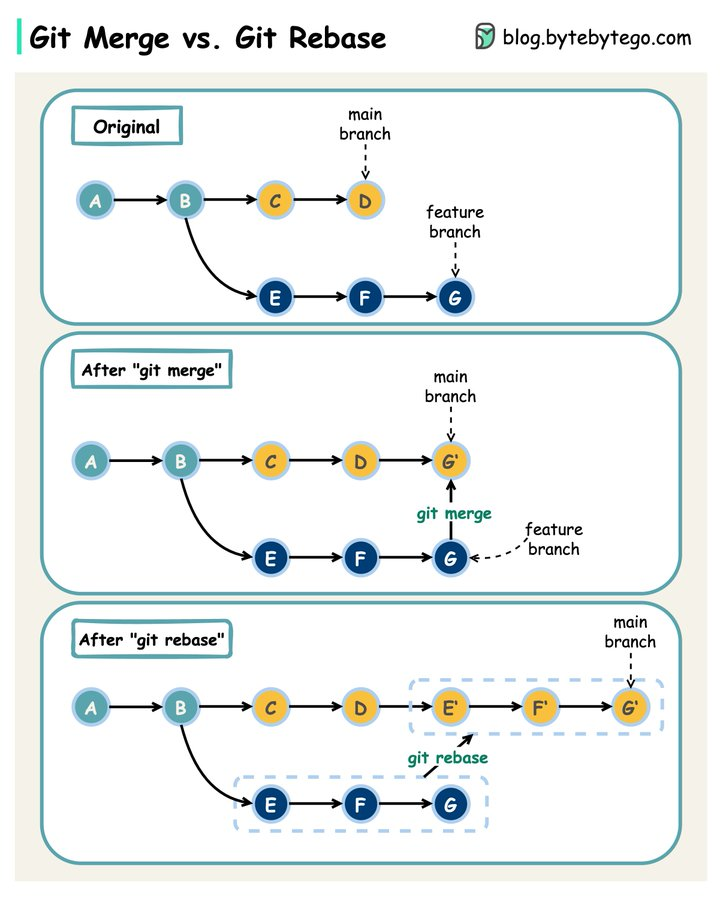

/_
@author: midudev
@url: https://twitter.com/midudev/status/1758124622627627357
_/

Con ambos puedes integrar cambios...
Pero afectan diferente al historial de commits

git merge

-   Git combina los cambios de una rama a otra.
-   Deja el historial de commits intacto, incluyendo la historia de ambas ramas y creando un nuevo commit de "merge" que tiene como padres a los últimos commits de las ramas que se están uniendo.

Puede resultar en un historial de commits no lineal pero completo, que preserva el contexto de cómo y cuándo se hicieron los cambios.

Uso recomendado: Útil cuando quieres mantener un registro explícito de todos los cambios en el historial, o cuando estás combinando ramas públicas en las que es importante preservar la historia del proyecto.

git rebase

-   Traslada los commits de una rama a otra.
-   Reescribe el historial de commits para crear una línea de desarrollo más lineal.

Puede hacer que el historial sea más limpio y fácil de seguir, pero modifica el historial existente, lo que puede complicar el seguimiento de cambios si no se utiliza correctamente.

Uso recomendado: Ideal para limpiar el historial de una rama de desarrollo privada antes de integrarla a una rama pública, o para actualizar una rama de desarrollo con los últimos cambios de la rama principal, manteniendo un historial lineal.

Ojo, ¡Evita siempre el uso de git rebase en la rama principal!

