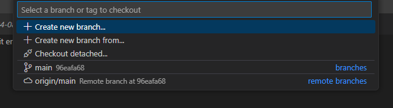
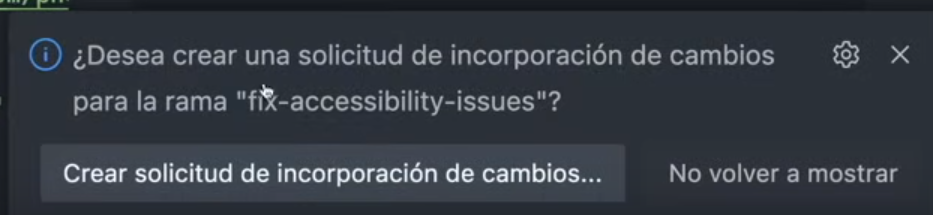
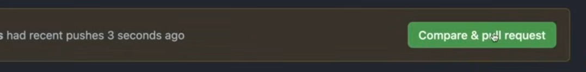
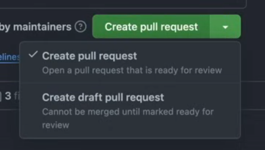

## Cómo hacer una Pull Request

Antes de empezar, revisa el archivo `CONTRIBUTE.md` del repositorio para asegurarte de seguir las pautas proporcionadas por los desarrolladores.

### 1. Hacer un fork del proyecto principal.

En GitHub, en la página del proyecto, le damos al botón de `Fork` para poder nosotros tener la posibilidad de modificar cosas en el proyecto.

### 2. Crear una nueva rama

Es recomendable que tus cambios se hagan en una nueva rama. Esto permite un control más organizado y evita conflictos con la rama principal.

Para crear una nueva rama en la terminal, usa el siguiente comando:

```bash
git switch -c nombre-de-la-rama-con-cambios
```

Alternativamente, en VSCode puedes crear una rama haciendo clic en el botón de selección de rama:


Luego selecciona `+ Crear una rama` y asigna un nombre:



### 3. Cambiar a la nueva rama

Una vez creada la rama, cámbiate a ella usando:

```bash
git switch nombre-de-la-rama-con-cambios
```

> **Nota:** `git switch` es el comando recomendado para cambiar entre ramas, en lugar de `git checkout`, ya que sigue la filosofía de Unix de hacer una sola cosa.

### 4. Mantén los cambios específicos

Al hacer una Pull Request, intenta modificar solo lo necesario para tu propósito. Es preferible hacer múltiples PRs pequeñas y específicas, en lugar de una única PR con varios cambios diferentes.

### 5. Confirmar cambios y publicar la rama

Escribe una descripción clara para tu commit y envíalo. Si estás usando GitHub Desktop o VSCode, al hacer esto solo estás confirmando los cambios en tu repositorio local (haciendo un "commit"), pero aún no los has enviado al repositorio remoto.

Para publicar la rama, puedes usar el botón en VSCode:


Selecciona la opción de publicar en `origin`, que es donde tienes permiso para crear nuevas ramas:


También puedes usar la terminal para hacer push de tu rama:

```bash
git push origin nombre-de-la-rama-con-cambios
```

### 6. Crear la Pull Request en GitHub

GitHub detectará automáticamente que has hecho un `push` de una nueva rama y sugerirá crear una Pull Request para integrar tus cambios en la rama principal:



Si esto no ocurre, en la página de inicio de tu fork en GitHub verás una notificación de actividad reciente, desde donde podrás comparar y abrir una Pull Request:



Al abrir la Pull Request, GitHub te pedirá que confirmes los cambios que deseas enviar y el repositorio de destino. Describe brevemente tu Pull Request, indicando qué problema resuelve o qué mejoras incluye. Puedes añadir imágenes o diagramas si lo consideras útil.

### 7. Opciones de Pull Request

Al crear la Pull Request, puedes elegir entre dos opciones en el botón `Create Pull Request`:



1. **Pull Request normal:** lista para revisión y posible fusión.
2. **Draft Pull Request:** funciona como un borrador. El autor del repositorio no podrá fusionar esta PR hasta que se marque como "lista", lo que te permite trabajar en cambios adicionales antes de la revisión final.

## Recursos
---
- [Cómo hacer una PR by Midudev](https://www.youtube.com/watch?v=BPns9r76vSI)