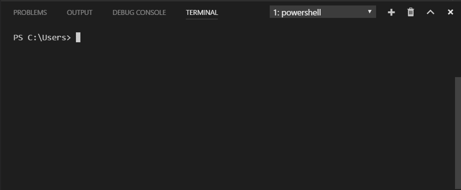
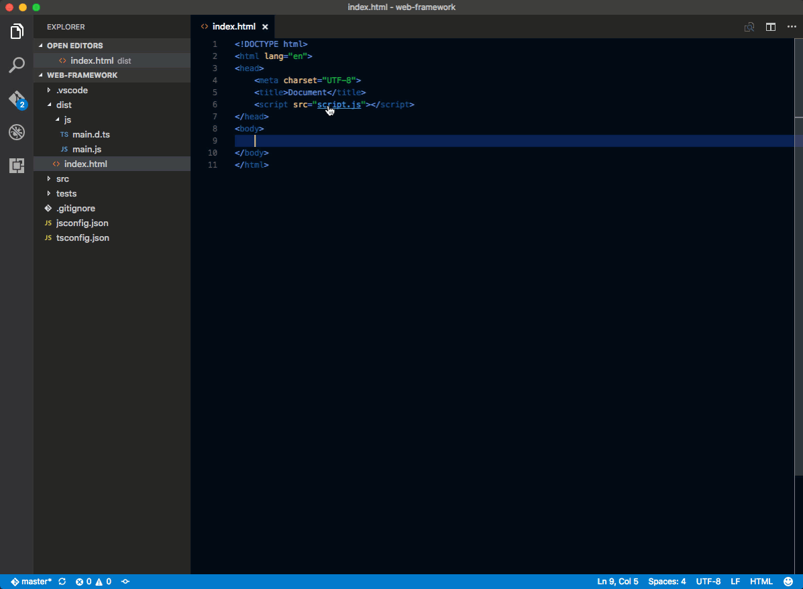
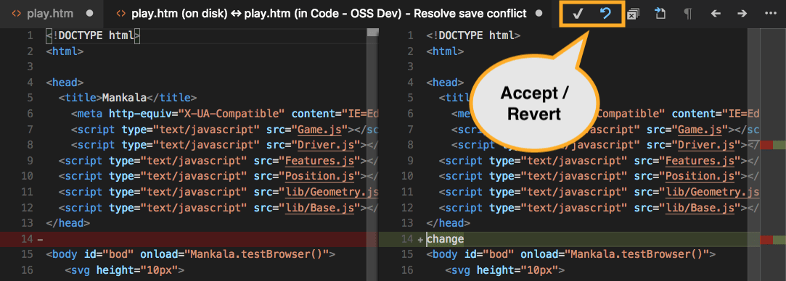
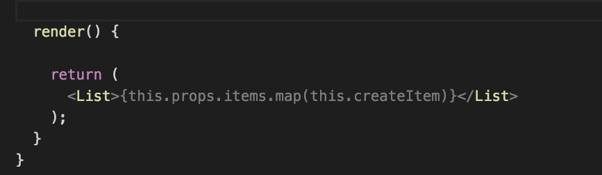
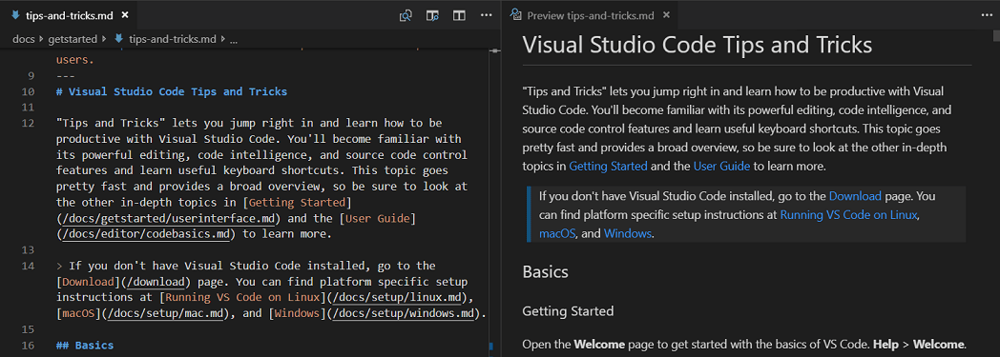

# [Visual Studio Code Tips and Tricks](https://code.visualstudio.com/docs/getstarted/tips-and-tricks)

## Basics

### Command Palette

Access all available commands based on your current context: `Ctrl+Shift+P`

### Keyboard reference sheets

[Keyboard shortcut reference](../../IMG/VSCode/keyboard-shorcuts.png)

## Status Bar

### Errors and warnings

Keyboard Shortcut: `Ctrl+Shift+M`

Quickly jump to errors and warnings in the project.

Cycle through errors with `F8` or `Shift+F8`


You can filter problems either by type ('errors', 'warnings') or text matching.

## Customization

### Add JSON validation

Enabled by default for many file types. Create your own schema and validation in `settings.json`

```json
"json.schemas": [
    {
        "fileMatch": [
            "bower.json"
        ],
        "url": "https://json.schemastore.org/bower"
    }
]
```

or for a schema defined in your workspace

```json
"json.schemas": [
    {
        "fileMatch": [
            "**/foo.json"
        ],
        "url": "./myschema.json"
    }
]
```

or a custom schema

```json
"json.schemas": [
    {
        "fileMatch": [
            "/.myconfig"
        ],
        "schema": {
            "type": "object",
            "properties": {
                "name" : {
                    "type": "string",
                    "description": "The name of the entry"
                }
            }
        }
    }
]
```

## Files and folders

### Integrated Terminal

Keyboard Shortcut: `Ctrl+`



Further reading:

-   [Integrated Terminal](https://code.visualstudio.com/docs/terminal/basics) documentation
-   [Mastering VS Code's Terminal article](https://www.growingwiththeweb.com/2017/03/mastering-vscodes-terminal.html)

### Toggle Sidebar

Keyboard Shortcut: `Ctrl+B`


### Toggle Panel

Keyboard Shortcut: `Ctrl+J`

### Zen mode

Keyboard Shortcut: `Ctrl+K Z`


Press `Esc` twice to exit Zen Mode.

### Side by side editing

Keyboard Shortcut: `Ctrl+\`

You can also drag and drop editors to create new editor groups and move editors between groups.


### Create or open a file

Keyboard Shortcut: `Ctrl+click`

You can quickly open a file or image or create a new file by moving the cursor to the file link and using `Ctrl+click`.



### Preventing dirty writes

VS Code will show you an error message when you try to save a file that cannot be saved because it has changed on disk. VS Code blocks saving the file to prevent overwriting changes that have been made outside of the editor.

In order to resolve the save conflict, click the **Compare** action in the error message to open a diff editor that will show you the contents of the file on disk (to the left) compared to the contents in VS Code (on the right):



Use the actions in the editor toolbar to resolve the save conflict. You can either **Accept** your changes and thereby overwriting any changes on disk, or **Revert** to the version on disk. Reverting means that your changes will be lost.

**Note:** The file will remain dirty and cannot be saved until you pick one of the two actions to resolve the conflict.

## Editing hacks

**Tip**: You can see recommended keymap extensions in the **Extensions** view by filtering the search to `@recommended:keymaps`.

### Multi cursor selection

To add cursors at arbitrary positions, select a position with your mouse and use `Alt+Click`.

To set cursors above or below the current position use:

Keyboard Shortcut: `Ctrl+Alt+Up` or `Ctrl+Alt+Down`


You can add additional cursors to all occurrences of the current selection with `Ctrl+Shift+L`.


If you do not want to add all occurrences of the current selection, you can use `Ctrl+D` instead.
This only selects the next occurrence after the one you selected so you can add selections one by one.


### Column (box) selection

You can select blocks of text by holding `Shift+Alt` while you drag your mouse. A separate cursor will be added to the end of each selected line.


### Fast scrolling

Pressing the `Alt` key enables fast scrolling in the editor and Explorers. By default, fast scrolling uses a 5X speed multiplier but you can control the multiplier with the **Editor: Fast Scroll Sensitivity** (`editor.fastScrollSensitivity`) setting.

### Copy line up / down

Keyboard Shortcut: `Shift+Alt+Up` or `Shift+Alt+Down`

> The commands **Copy Line Up/Down** are unbound on Linux because the VS Code default keybindings would conflict with Ubuntu keybindings, see [Issue #509](https://github.com/microsoft/vscode/issues/509). You can still set the commands `editor.action.copyLinesUpAction` and `editor.action.copyLinesDownAction` to your own preferred keyboard shortcuts.


### Move line up and down

Keyboard Shortcut: `Alt+Up` or `Alt+Down`


### Shrink / expand selection

Keyboard Shortcut: `Shift+Alt+Left` or `Shift+Alt+Rigth`

You can learn more in the [Basic Editing](https://code.visualstudio.com/docs/editor/codebasics#_shrinkexpand-selection) documentation.

### Navigate to a specific line

Keyboard Shortcut: `Ctrl+G`

### Trim trailing whitespace

Keyboard Shortcut: `Ctrl+K Ctrl+X`



### Transform text commands

You can change selected text to uppercase, lowercase, and title case with the **Transform** commands from the Command Palette.


### Code formatting

Currently selected source code: `Ctrl+K Ctrl+F`

Whole document format: `Shift+Alt+F`


### Code folding

Keyboard Shortcut: `Ctrl+Shift+[` and `Ctrl+Shift+]`


You can also fold/unfold all regions in the editor with **Fold All** (`Ctrl+K Ctrl+0`) and **Unfold All** (`Ctrl+K Ctrl+J`).

You can fold all block comments with **Fold All Block Comments** (`Ctrl+K Ctrl+/`).

### Select current line

Keyboard Shortcut: `Ctrl+L`

### Navigate to beginning and end of file

Keyboard Shortcut: `Ctrl+Home` and `Ctrl+End`

### Open Markdown preview

In a Markdown file, use

Keyboard Shortcut: `Ctrl+Shift+V`

### Side by side Markdown edit and preview

In a Markdown file, use

Keyboard Shortcut: `Ctrl+K V`

The preview and editor will synchronize with your scrolling in either view.



### Peek

Select a symbol then type `Alt+F12`. Alternatively, you can use the context menu.


### Go to Definition

Select a symbol then type `F12`. Alternatively, you can use the context menu or `Ctrl+click`.


You can go back to your previous location with the **Go** > **Back** command or `Alt+Left`.

You can also see the type definition if you press `Ctrl` when you are hovering over the type.

### Go to References

Select a symbol then type `Shift+F12`. Alternatively, you can use the context menu.


### Rename Symbol

Select a symbol then type `F2`. Alternatively, you can use the context menu.


### .eslintrc.json

Install the [ESLint extension](https://marketplace.visualstudio.com/items?itemName=dbaeumer.vscode-eslint). Configure
your linter however you'd like. Consult the [ESLint specification](https://eslint.org/docs/user-guide/configuring) for details on its linting rules and options.

Here is configuration to use ES6.

```json
{
    "env": {
        "browser": true,
        "commonjs": true,
        "es6": true,
        "node": true
    },
    "parserOptions": {
        "ecmaVersion": 6,
        "sourceType": "module",
        "ecmaFeatures": {
            "jsx": true,
            "classes": true,
            "defaultParams": true
        }
    },
    "rules": {
        "no-const-assign": 1,
        "no-extra-semi": 0,
        "semi": 0,
        "no-fallthrough": 0,
        "no-empty": 0,
        "no-mixed-spaces-and-tabs": 0,
        "no-redeclare": 0,
        "no-this-before-super": 1,
        "no-undef": 1,
        "no-unreachable": 1,
        "no-use-before-define": 0,
        "constructor-super": 1,
        "curly": 0,
        "eqeqeq": 0,
        "func-names": 0,
        "valid-typeof": 1
    }
}
```

### package.json

See IntelliSense for your `package.json` file.


## Snippets

## Git integration

### Diffs

From the **Source Control** view, select a file to open the diff.


Alternatively, click the **Open Changes** button in the top right corner to diff the current open file.

**Views**

The default view for diffs is the **side by side view**.

Toggle **inline view** by clicking the **More Actions** (...) button in the top right and selecting **Toggle Inline View**.

If you prefer the inline view, you can set `"diffEditor.renderSideBySide": false`.

**Accessible Diff Viewer**

Navigate through diffs with `kb(editor.action.accessibleDiffViewer.next)` and `kb(editor.action.accessibleDiffViewer.prev)`. This will present them in a unified patch format. Lines can be navigated with arrow keys and pressing `kbstyle(Enter)` will jump back in the diff editor and the selected line.

**Edit pending changes**

You can make edits directly in the pending changes of the diff view.

### Undo last commit

Click the (...) button and then select **Undo Last Commit** to undo the previous commit. The changes are added to the Staged Changes section.


### Resolve merge conflicts

During a merge, go to the **Source Control** view (`Ctrl+Shift+G`) and make changes in the diff view.

You can resolve merge conflicts with the inline CodeLens which lets you **Accept Current Change**, **Accept Incoming Change**, **Accept Both Changes**, and **Compare Changes**.

### Set VS Code as default merge tool

```bash
git config --global merge.tool vscode
git config --global mergetool.vscode.cmd 'code --wait $MERGED'
```

### Set VS Code as default diff tool

```bash
git config --global diff.tool vscode
git config --global difftool.vscode.cmd 'code --wait --diff $LOCAL $REMOTE'
```

## Resources

[Using React in Visual Studio Code](https://code.visualstudio.com/docs/nodejs/reactjs-tutorial)
