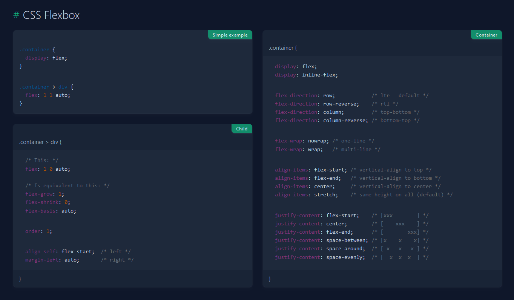
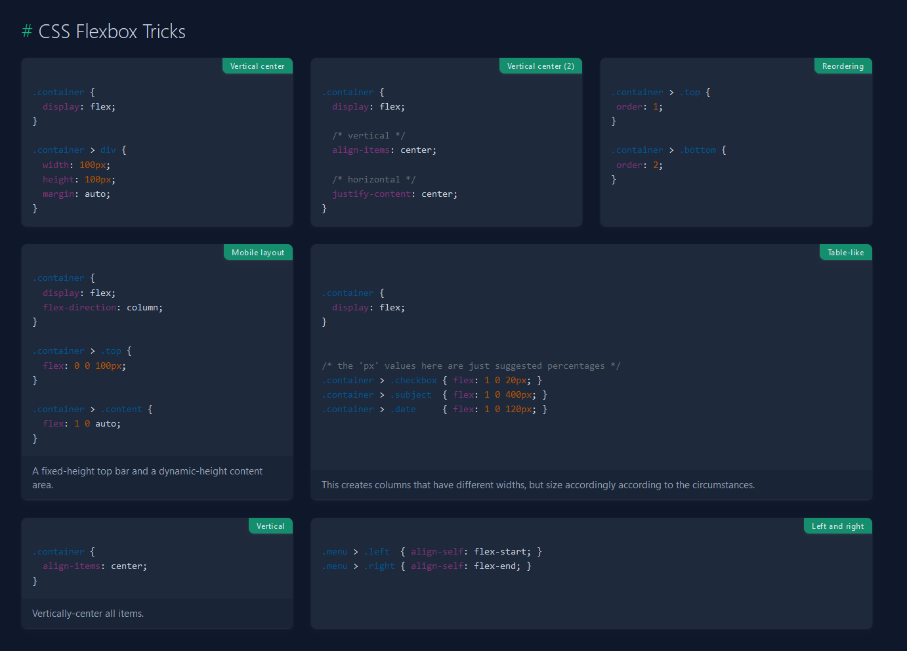

# [FLEXBOX](https://developer.mozilla.org/en-US/docs/Web/CSS/CSS_flexible_box_layout/Basic_concepts_of_flexbox)

CSS Flexbox (Flexible Box Layout) es un módulo de CSS que proporciona un método más eficiente y predecible para diseñar y distribuir elementos dentro de un contenedor, incluso cuando el tamaño de los elementos y del contenedor es desconocido o dinámico. Flexbox ofrece un sistema de diseño unidimensional, lo que significa que se centra en el diseño de una fila o columna de elementos a la vez.

Algunas características y ventajas clave de Flexbox incluyen:

-   Diseño flexible y dinámico: Permite a los elementos dentro de un contenedor ajustarse automáticamente según el tamaño del contenedor y el tamaño de los elementos, lo que facilita la creación de diseños adaptables y responsivos.

-   Ordenamiento de elementos: Los elementos pueden ser reorganizados fácilmente en función del diseño deseado, independientemente de su orden en el HTML.

-   Alineación y distribución: Proporciona varias propiedades para alinear y distribuir elementos dentro de un contenedor, como alinear al centro, alinear a la izquierda, distribuir uniformemente, etc.

-   Espaciado flexible: Ofrece un control preciso sobre el espacio entre los elementos, tanto dentro como fuera del contenedor.

-   Nesting (Anidamiento) simplificado: Los contenedores flexibles se pueden anidar dentro de otros contenedores flexibles, lo que facilita la creación de diseños complejos y jerárquicos.

-   Compatibilidad multiplataforma: Flexbox es compatible con la mayoría de los navegadores modernos, lo que lo convierte en una opción sólida para el diseño de interfaces de usuario en la web.

En resumen, CSS Flexbox es una poderosa herramienta de diseño que simplifica la creación de diseños flexibles y responsivos en la web, ofreciendo un mayor control sobre la disposición y distribución de los elementos en una página.

Para poder usar `flex`, no tenemos que usarlo en el contenedor padre, ya que literalmente flex determina como se tiene que comportar el contenedor respecto a sus hijos.
Esto permite tener un contenedor que sea flexible y alinear los contenedores de una manera más eficiente, ya sea verticalmente o horizontalmente, y teniendo tamaños conocidos o desconocidos.

```html
<section class="parent">
    <div class="item">1</div>
    <div class="item">2</div>
    <div class="item">3</div>
</section>

<style type="text/css">
    .parent {
        display: flex;
    }

    .item {
        border: 1px solid;
        opacity: 0.9;
        width: 100px;
        height: 100px;
        background: #09f;
    }

    .item:first-child {
        background: yellow;
    }

    .item:nth-child(2) {
        background: blue;
    }

    .item:last-child {
        background: red;
    }
</style>
```

## [CSS Grid](https://github.com/ShunTr-dev/Docs/blob/main/CSS/CSS%20Grid.md) vs [CSS Flex](https://github.com/ShunTr-dev/Docs/blob/main/CSS/CSS%20Flex.md)

CSS Grid y CSS Flexbox son dos herramientas poderosas para el diseño de diseños en CSS, pero tienen diferentes enfoques y funcionalidades. Estas son las diferencias clave entre CSS Grid y CSS Flexbox:

-   Modelo de disposición:

*   CSS Grid: Funciona en **dos dimensiones** (filas y columnas) y permite colocar elementos en una cuadrícula bidimensional.
*   CSS Flexbox: Funciona en **una dimensión** (fila o columna) y es ideal para organizar elementos en una sola dirección, como una fila o una columna.

-   Flexibilidad:

*   CSS Grid: Proporciona un mayor control sobre el diseño de la página, permitiendo dividir el espacio del contenedor en filas y columnas definidas por el desarrollador.
*   CSS Flexbox: Ofrece flexibilidad en la alineación y distribución de elementos en una sola dirección, pero puede no ser tan adecuado para diseños bidimensionales complejos.

-   Alineación:

*   CSS Grid: Permite alinear elementos tanto en el eje de las filas como en el de las columnas, utilizando propiedades como justify-items, align-items, justify-content, align-content, entre otras.
*   CSS Flexbox: Se enfoca en la alineación de elementos a lo largo de un solo eje, con propiedades como justify-content y align-items.

-   Orden de los elementos:

*   CSS Grid: Facilita cambiar el orden de los elementos en la cuadrícula sin alterar el orden en el HTML, lo que brinda una mayor flexibilidad en el diseño.
*   CSS Flexbox: También permite cambiar el orden de los elementos, pero principalmente a lo largo de un eje único.

-   Uso recomendado:

*   CSS Grid: Es más adecuado para diseños de página complejos y bidimensionales, como esquemas de mosaicos, cuadrículas de imágenes y diseños de estilo editorial.
*   CSS Flexbox: Es útil para alinear y distribuir elementos en una sola dirección, como menús de navegación, barras laterales y diseños de elementos en línea.

En resumen, CSS Grid es ideal para diseñar diseños bidimensionales complejos y controlar el flujo de contenido en una página web, mientras que CSS Flexbox es más adecuado para organizar elementos en una sola dirección de manera flexible y eficiente. Ambos pueden utilizarse juntos según las necesidades específicas de diseño de un proyecto.

## `flex-direction`

La propiedad `flex-direction` se utiliza para establecer la dirección principal en la que se disponen los elementos dentro de un contenedor flexible. Determina si los elementos hijos se disponen en una fila o en una columna, y si se colocan de izquierda a derecha, de derecha a izquierda, de arriba hacia abajo o de abajo hacia arriba.

La dirección establecida en `flex-direction` es la parte mas significativa de flex, ya que sólo puedes trabajar con una dirección (O filas o columnas), siendo esta la diferencia más grande con CSS Grid. En el caso de CSS Grid se trabaja con una malla o cuadrícula.

```css
.container {
    display: flex;
    flex-direction: row; /* Los elementos se disponen en una fila horizontal (de izquierda a derecha) */
}

.container-reverse {
    display: flex;
    flex-direction: row-reverse; /* Los elementos se disponen en una fila horizontal, pero en dirección inversa (de derecha a izquierda) */
}

.container-column {
    display: flex;
    flex-direction: column; /* Los elementos se disponen en una columna vertical (de arriba hacia abajo) */
}

.container-column-reverse {
    display: flex;
    flex-direction: column-reverse; /* Los elementos se disponen en una columna vertical, pero en dirección inversa (de abajo hacia arriba) */
}
```

## `flex-wrap`

La propiedad `flex-wrap` se utiliza para especificar si los elementos hijos deben envolverse o no cuando no haya suficiente espacio en el contenedor para mostrarlos en una sola línea.

```css
.container {
    display: flex;
    flex-wrap: nowrap; /* Los elementos no se envuelven y se muestran en una sola línea */
}

.container-wrap {
    display: flex;
    flex-wrap: wrap; /* Los elementos se envuelven en líneas adicionales si no caben en una sola línea */
}

.container-wrap-reverse {
    display: flex;
    flex-wrap: wrap-reverse; /* Los elementos se envuelven en líneas adicionales, pero en orden inverso, si no caben en una sola línea */
}
```

## `flex-flow`

La propiedad flex-flow en CSS es una propiedad abreviada que combina las propiedades flex-direction y flex-wrap en una sola declaración. Esto permite especificar tanto la dirección de los elementos dentro del contenedor como si los elementos deben envolverse o no en una sola declaración.

```css
.container {
    flex-flow: <flex-direction> <flex-wrap>;
}
```

## `flex-grow`, `flex-shrink`, `flex-basis`

Las propiedades `flex-grow`, `flex-shrink` y `flex-basis` se utilizan para controlar cómo se distribuye y ajusta el espacio disponible entre estos elementos.

`flex-grow`:

-   La propiedad `flex-grow` define la capacidad de un elemento para crecer en relación con otros elementos en el contenedor cuando hay espacio adicional disponible.
-   Toma un valor numérico que representa la proporción en la que el elemento debe crecer en comparación con otros elementos. Por ejemplo, si dos elementos tienen `flex-grow` con valores 1 y 2 respectivamente, el segundo elemento crecerá el doble que el primero cuando haya espacio disponible.
-   **El valor predeterminado es 0**, lo que significa que el elemento no crecerá más allá de su tamaño inicial.

`flex-shrink`:

-   La propiedad `flex-shrink` define la capacidad de un elemento para encogerse en relación con otros elementos en el contenedor cuando el espacio disponible es insuficiente.
-   También toma un valor numérico que representa la proporción en la que el elemento debe encogerse en comparación con otros elementos. Por ejemplo, si dos elementos tienen flex-shrink con valores 1 y 2 respectivamente, el segundo elemento se encogerá el doble que el primero cuando no haya suficiente espacio disponible.
-   **El valor predeterminado es 1**, lo que significa que el elemento se encogerá en la misma proporción que otros elementos.

`flex-basis`:

-   La propiedad `flex-basis` establece el tamaño inicial del elemento antes de que se apliquen `flex-grow` y `flex-shrink`.
-   Puede tomar un valor fijo, como `px`, `em` o `%`, o un valor relativo, como `auto`, que indica que el tamaño se determinará según el contenido del elemento.

El conjunto de `flex-grow: 1;`, `flex-shrink: 1;` y `flex-basis: auto`, es lo que se conoce como `flex: auto`.

### `flex: auto;`

La declaración `flex: auto;` es una forma abreviada de establecer las propiedades `flex-grow`, `flex-shrink` y `flex-basis` en una sola línea. A grandes rasgos significa que el conjunto se adapta en función del contenido, por lo tanto si hay un elemento que tiene un contenido mayor será más grande que el resto.

-   `flex-grow: 1;`: Esto hace que el elemento pueda crecer para ocupar todo el espacio disponible dentro del contenedor, distribuyendo el espacio restante entre los elementos que tienen un flex-grow diferente de 0.
-   `flex-shrink: 1;`: Esto significa que el elemento puede encogerse en la misma proporción que otros elementos en el mismo contenedor si no hay suficiente espacio disponible.
-   `flex-basis: auto;`: Esto establece el tamaño inicial del elemento en su tamaño intrínseco basado en su contenido y otras propiedades CSS aplicadas a él.

### `flex: 1;`

La declaración `flex: 1;` es una forma abreviada de establecer las propiedades `flex-grow`, `flex-shrink` y `flex-basis` en una sola línea.

-   `flex-grow: 1;`: Esto hace que el elemento crezca y ocupe todo el espacio disponible dentro del contenedor. Si hay otros elementos en el mismo contenedor, el espacio se distribuirá de manera equitativa entre ellos.
-   `flex-shrink: 1;`: Esto permite que el elemento se encoja si es necesario para ajustarse al contenedor. El valor de 1 indica que el elemento puede reducirse en la misma proporción que otros elementos en el mismo contenedor.
-   `flex-basis: 0;`: Esto establece el tamaño inicial del elemento en 0. Esto significa que el tamaño inicial del elemento será determinado únicamente por `flex-grow` y `flex-shrink`, y no por un tamaño fijo o relativo.

En `flex: 1;` el `1` también **puede considerarse una medida relativa de lo que tienen que ocupar los elementos**. De tal manera que si le ponemos un `2` ese elemento crecerá el doble de tamaño que el resto.

## `order`

La propiedad `order` se utiliza para controlar el orden en el que aparecen los elementos dentro del contenedor. Esta propiedad acepta un valor numérico que determina el orden en el que se muestran los elementos en relación con otros elementos en el mismo contenedor.

Por defecto, los elementos se ordenan según el orden en el que aparecen en el marcado HTML. Sin embargo, la propiedad order permite modificar este orden sin cambiar la estructura del documento HTML.

```css
.container {
    display: flex;
}

.item1 {
    order: 3; /* Este elemento aparecerá tercero */
}

.item2 {
    order: 1; /* Este elemento aparecerá primero */
}

.item3 {
    order: 2; /* Este elemento aparecerá segundo */
}
```

## `justify-content`

La propiedad `justify-content` se utiliza para alinear los elementos a lo largo del eje principal del contenedor. Esta propiedad permite distribuir el espacio sobrante (o ajustar el espacio faltante) entre los elementos de diferentes maneras, dependiendo del valor especificado.

Los valores posibles para justify-content son los siguientes:

-   `flex-start`: Los elementos se alinean hacia el principio del contenedor. Es decir, se alinean en el lado izquierdo (en el caso de una disposición de fila) o en la parte superior (en el caso de una disposición de columna) del contenedor.

-   `flex-end`: Los elementos se alinean hacia el final del contenedor. Es decir, se alinean en el lado derecho (en el caso de una disposición de fila) o en la parte inferior (en el caso de una disposición de columna) del contenedor.

-   `center`: Los elementos se alinean en el centro del contenedorl.

-   `space-between`: Los elementos se distribuyen uniformemente a lo largo del eje principal del contenedor, con el primer elemento alineado hacia el principio del contenedor y el último elemento alineado hacia el final del contenedor. El espacio entre los elementos es igual.

-   `space-around`: Los elementos se distribuyen uniformemente a lo largo del eje principal del contenedor, con un espacio igual alrededor de cada elemento. Esto significa que el espacio entre los elementos es el doble del espacio en los extremos del contenedor.

-   `space-evenly`: Similar a space-around, pero el espacio entre los elementos y en los extremos del contenedor es el mismo. Por lo tanto, el espacio entre los elementos es igual en todas partes.

```css
.container {
    display: flex;
    justify-content: center; /* Los elementos se alinean en el centro del contenedor */
}
```

Se pueden controlar los espacios entre elementos usando la propiedad de `gap`, auque no sea de Flexbox si no de CSS Grid. Poniendo `gap: 16px;` los elementos se separarán `16px`.

## `align-items` vs `align-content`

En CSS Flexbox, tanto `align-items` como `align-content` se utilizan para alinear elementos a lo largo del eje transversal (eje perpendicular al principal) del contenedor . Sin embargo, tienen diferentes propósitos y comportamientos:

1. `align-items`:

-   `align-items` se aplica a los elementos dentro del contenedor. Define cómo se alinean los elementos individualmente dentro del contenedor a lo largo del eje transversal.
-   Esta propiedad afecta a cada elemento de manera individual, permitiendo controlar la alineación vertical (si el eje principal es horizontal) de cada elemento dentro del contenedor.
-   Los valores comunes para align-items incluyen: `flex-start`, `center`, `flex-end`, `baseline`, `stretch`, entre otros.

2. `align-content`:

-   `align-content` se aplica al contenedor en sí, no a los elementos dentro de él. Define cómo se distribuyen los espacios adicionales en el eje transversal del contenedor cuando hay espacio adicional disponible.
-   Esta propiedad solo tiene efecto cuando hay espacio adicional en el eje transversal del contenedor flex y cuando los elementos flexibles no ocupan todo ese espacio. En otras palabras, solo es relevante cuando los elementos flexibles tienen `flex-wrap` configurado y se "envuelven" en líneas adicionales.
-   Los valores comunes para `align-content` incluyen: `flex-start`, `center`, `flex-end`, `space-between`, `space-around`, `stretch`, entre otros.

En resumen, `align-items` se aplica a los elementos flexibles dentro del contenedor y controla su alineación individual en el eje transversal, mientras que `align-content` se aplica al contenedor flex y controla la distribución del espacio adicional en el eje transversal cuando hay varias líneas de elementos flexibles.

# Recursos:

-   [Flexbox Froggy - Un juego para aprender flexbox](https://flexboxfroggy.com/#es)
-   [Flexbox CheatSheet](https://quickref.me/css3#css-flexbox)
    
-   [Flexbox CheatSheet Tricks](https://quickref.me/css3#css-flexbox-tricks)
    
