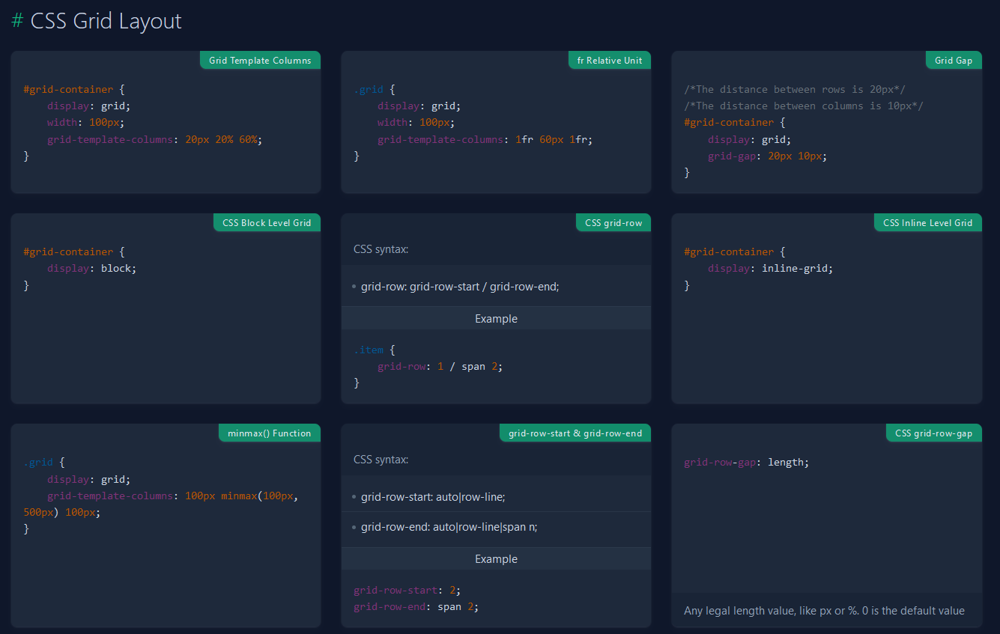
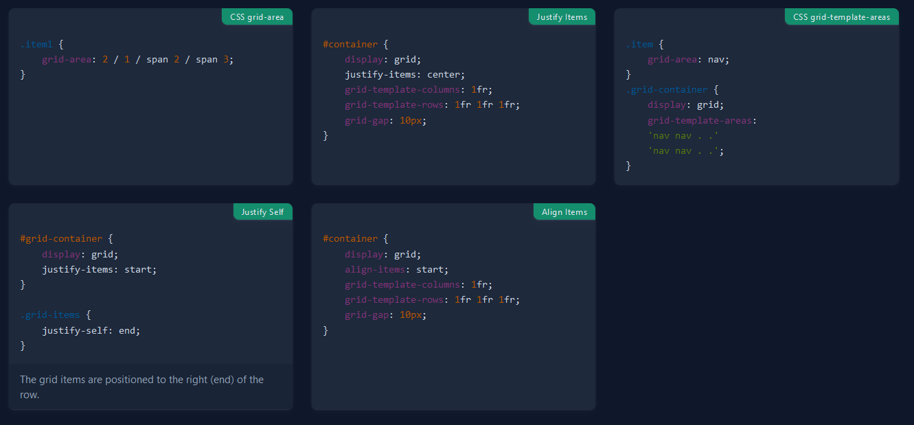

# CSS Grid

CSS Grid es un módulo de CSS que permite crear diseños de página más complejos y flexibles en comparación con los métodos tradicionales de diseño web. Con CSS Grid, puedes crear fácilmente una cuadrícula bidimensional donde puedes colocar elementos HTML en filas y columnas.

-   Diseño bidimensional: A diferencia de Flexbox, que trabaja principalmente en una dimensión (fila o columna), CSS Grid funciona en dos dimensiones, permitiendo colocar elementos tanto en filas como en columnas.
-   División de espacio: CSS Grid divide el espacio del contenedor en filas y columnas definidas por el desarrollador. Esto ofrece un mayor control sobre el diseño de la página.
-   Control del flujo de contenido: CSS Grid permite especificar cómo los elementos HTML fluyen dentro de la cuadrícula, lo que brinda una flexibilidad significativa para la disposición de los elementos en la página.
-   Alineación y espaciado: Con CSS Grid, puedes alinear y distribuir elementos a lo largo de las filas y columnas de la cuadrícula con propiedades como justify-items, align-items, justify-content, align-content, grid-gap, entre otras.
-   Ordenación de elementos: CSS Grid permite cambiar fácilmente el orden de los elementos en la cuadrícula sin alterar el orden en el HTML, lo que proporciona una mayor flexibilidad en el diseño.

En resumen, CSS Grid es una herramienta poderosa que permite crear diseños complejos y flexibles en las páginas web, proporcionando un control preciso sobre la disposición y el flujo de los elementos en una cuadrícula bidimensional. Es especialmente útil para diseñar diseños más avanzados y adaptativos en sitios web modernos.

```html
<div class="container">
    <div>1</div>
    <div>2</div>
    <div>3</div>
    <div>4</div>
    <div>5</div>
    <div>6</div>
</div>

<style type="text/css">
    .container {
        background: #09f;
        border: 3px solid gray;
        border-radius: 10px;
        display: grid;
        grid-template-columns: ;
    }

    .container div {
        background: lightblue;
        border: 2px white;
    }
</style>
```

## [CSS Grid](https://github.com/ShunTr-dev/Docs/blob/main/CSS/CSS%20Grid.md) vs [CSS Flex](https://github.com/ShunTr-dev/Docs/blob/main/CSS/CSS%20Flex.md)

CSS Grid y CSS Flexbox son dos herramientas poderosas para el diseño de diseños en CSS, pero tienen diferentes enfoques y funcionalidades. Estas son las diferencias clave entre CSS Grid y CSS Flexbox:

-   Modelo de disposición:

*   CSS Grid: Funciona en **dos dimensiones** (filas y columnas) y permite colocar elementos en una cuadrícula bidimensional.
*   CSS Flexbox: Funciona en **una dimensión** (fila o columna) y es ideal para organizar elementos en una sola dirección, como una fila o una columna.

-   Flexibilidad:

*   CSS Grid: Proporciona un mayor control sobre el diseño de la página, permitiendo dividir el espacio del contenedor en filas y columnas definidas por el desarrollador.
*   CSS Flexbox: Ofrece flexibilidad en la alineación y distribución de elementos en una sola dirección, pero puede no ser tan adecuado para diseños bidimensionales complejos.

-   Alineación:

*   CSS Grid: Permite alinear elementos tanto en el eje de las filas como en el de las columnas, utilizando propiedades como justify-items, align-items, justify-content, align-content, entre otras.
*   CSS Flexbox: Se enfoca en la alineación de elementos a lo largo de un solo eje, con propiedades como justify-content y align-items.

-   Orden de los elementos:

*   CSS Grid: Facilita cambiar el orden de los elementos en la cuadrícula sin alterar el orden en el HTML, lo que brinda una mayor flexibilidad en el diseño.
*   CSS Flexbox: También permite cambiar el orden de los elementos, pero principalmente a lo largo de un eje único.

-   Uso recomendado:

*   CSS Grid: Es más adecuado para diseños de página complejos y bidimensionales, como esquemas de mosaicos, cuadrículas de imágenes y diseños de estilo editorial.
*   CSS Flexbox: Es útil para alinear y distribuir elementos en una sola dirección, como menús de navegación, barras laterales y diseños de elementos en línea.

En resumen, CSS Grid es ideal para diseñar diseños bidimensionales complejos y controlar el flujo de contenido en una página web, mientras que CSS Flexbox es más adecuado para organizar elementos en una sola dirección de manera flexible y eficiente. Ambos pueden utilizarse juntos según las necesidades específicas de diseño de un proyecto.

## Fracciones

Las fracciones (`fr`) son una unidad de medida que se utiliza para distribuir el espacio disponible en una cuadrícula entre las filas o columnas. La unidad `fr` asigna una parte proporcional del espacio restante después de que se hayan asignado los tamaños a las filas o columnas definidas con otras unidades de medida.

```css
.grid-container {
    display: grid;
    grid-template-columns: 1fr 2fr 1fr; /* Tres columnas con la primera y la tercera ocupando una fracción del espacio disponible cada una, y la segunda ocupando el doble de esa cantidad */
    grid-template-rows: 1fr 2fr; /* Dos filas, ambas ocupando una fracción del espacio disponible, siendo la segunda el doble de alta que la primera */
}
```

-   `grid-template-columns` especifica tres columnas. La primera y la tercera tienen un tamaño que equivale a una fracción del espacio disponible, mientras que la segunda columna tiene el doble de tamaño que las otras dos.
-   `grid-template-rows` especifica dos filas. Ambas ocupan una fracción del espacio disponible, pero la segunda fila es el doble de alta que la primera.

## `grid-template-columns` y `grid-template-rows`

`grid-template-columns` y `grid-template-rows` son una propiedad que se utiliza para definir el tamaño y el número de columnas y filas en una cuadrícula. Esta propiedad permite especificar las dimensiones de las columnas y filas de una cuadrícula mediante valores absolutos, relativos o mediante funciones.

```css
.grid-container {
    display: grid;
    grid-template-columns: 100px 200px 1fr;
    grid-template-rows: 100px 200px 1fr;
}
```

-   100px, 200px y 1fr son los valores que definen el ancho de las columnas.
-   100px y 200px son valores absolutos, lo que significa que las primeras dos columnas tendrán un ancho fijo de 100 píxeles y 200 píxeles, respectivamente.
-   1fr es una unidad de fracción flexible, lo que significa que la tercera columna tomará el espacio restante disponible en el contenedor después de que se asignen los anchos a las primeras dos columnas.

También puedes usar otras unidades de medida (como porcentaje, `em`, `rem`, etc.) o funciones de CSS (como `minmax()`, `repeat()`, etc.) para definir el ancho de las columnas. Además, puedes especificar el número de columnas y sus tamaños de manera más dinámica y flexible según tus necesidades de diseño.
En este caso el valor de `auto` va a ser el navegador el que escoja el valor que ocupe el contenedor en función del contenido del texto.

La propiedad `grid-auto-rows` en se utiliza para establecer el tamaño predeterminado de las filas que se crean automáticamente en una cuadrícula cuando no se especifica explícitamente un tamaño para ellas. Esto significa que grid-auto-rows define el tamaño de las filas que se generan automáticamente cuando se añaden más filas de las que se han especificado explícitamente en la definición de la cuadrícula.

Esta propiedad es útil cuando estás creando una cuadrícula con un número desconocido de elementos y quieres asegurarte de que las filas generadas automáticamente tengan un tamaño consistente. Puedes incluso darle un tamaño a la primera fila con `grid-template-rows: 100px`, y el resto generarlas con el auto.

## `repeat()`

La función `repeat()` es una forma de repetir un patrón de columnas (`grid-template-columns`) o filas (`grid-template-rows`) en una cuadrícula. Esto es especialmente útil cuando quieres definir un número repetitivo de columnas o filas con el mismo tamaño.

```css
.container {
    grid-template-rows: repeat(number_of_times, size);
}
```

-   number_of_times: El número de veces que deseas repetir el patrón.
-   size: El tamaño de cada repetición del patrón de columnas o filas.

También puedes combinar repeat() con otras funciones o valores para crear patrones más complejos. Por ejemplo, para crear una cuadrícula con dos filas de 100 píxeles y una fila automática, puedes hacer lo siguiente:

```css
.grid-container {
    display: grid;
    grid-template-rows: repeat(2, 100px) auto;
}
```

## `minmax()`

La función `minmax()` en es una función que permite especificar un rango mínimo y máximo para el tamaño de las columnas (`grid-template-columns`) o filas (`grid-template-rows`) en una cuadrícula. Esta función es especialmente útil cuando deseas que las columnas o filas tengan un tamaño flexible dentro de un rango dado.

```css
.container {
    grid-template-rows: minmax(min_value, max_value);
}
```

-   min_value: Especifica el tamaño mínimo que puede tener la columna o fila.
-   max_value: Especifica el tamaño máximo que puede tener la columna o fila.

También puedes combinar minmax() con otras funciones o valores para crear diseños más complejos. Por ejemplo, si deseas una cuadrícula con tres columnas, donde la primera columna tiene un tamaño mínimo de 100 píxeles y un tamaño máximo de 200 píxeles, y las otras dos columnas se expanden automáticamente para llenar el espacio restante, puedes hacer lo siguiente:

```css
.grid-container {
    display: grid;
    grid-template-columns: minmax(100px, 200px) 1fr 1fr;
}
```

## Ejemplo

Cómo usar de manera correcta CSS Grid. Usamos el `@media` para crear momentos en los que se creen columnas. Pero hay que tener en cuenta el tamaño del contenido, y como se ve.

```html
<div>
    
    
    
    
    
    
    
    
    
    
</div>

<style type="text/css">
    div {
        display: grid;
        grid-template-columns: 1fr;
        /*
        column-gap: 16px;
        row-gap: 16px;
        */
        gap: 16px;
    }

    @media (width > 300px) {
        div {
            grid-template-columns: 1fr 1fr;
        }
    }

    @media (width > 600px) {
        div {
            grid-template-columns: 1fr 1fr 1fr;
        }
    }

    img {
        border-radius: 8px;
        width: 100%;
        height: auto;
    }
</style>
```

Lo ideal es hacerlo SIN `@media`.

```html
<div>
    
    
    
    
    
    
    
    
    
    
</div>

<style type="text/css">
    div {
        display: grid;
        grid-template-columns: repeat(auto-fill, minmax(200px, 1fr));
        gap: 16px;
        /* Si queremos meterle un número máximo de columnas
            max-width: 800px;
            margin: 0 auto;
        */
    }

    img {
        border-radius: 8px;
        width: 100%;
        height: auto;
    }
</style>
```

## `auto-fit` vs `auto-fill`

Ambas auto-fit y auto-fill son opciones en para distribuir el espacio disponible para los elementos en una cuadrícula, pero tienen diferencias en cómo manejan los espacios vacíos o los elementos extra.

-   `auto-fit`:

*   Con `auto-fit`, la cuadrícula ajusta automáticamente el número de columnas o filas para adaptarse al tamaño del contenedor. Si hay espacio adicional después de colocar los elementos, se crean nuevas columnas o filas vacías para llenar ese espacio.
*   Si hay más elementos que columnas o filas disponibles, algunos de los elementos pueden sobrepasar el contenedor o superponerse entre sí.
*   `auto-fit` intenta ajustar los elementos en la cuadrícula lo más compactamente posible, reduciendo el espacio vacío entre los elementos.

-   `auto-fill`:

*   Con `auto-fill`, la cuadrícula crea el número especificado de columnas o filas, pero puede rellenarlas con elementos adicionales si hay más elementos disponibles.
*   Si hay más elementos que columnas o filas especificadas, los elementos adicionales se colocan en nuevas filas o columnas, y estas filas o columnas vacías se muestran en el diseño.
*   `auto-fill` llena el espacio disponible con elementos, incluso si eso resulta en elementos más separados o más espacio en blanco dentro de la cuadrícula.

## `grid-column-start`, `grid-column-end`, `grid-row-start` y `grid-row-end`

Las propiedades `grid-column-start`, `grid-column-end`, `grid-row-start` y `grid-row-end` son propiedades que se utilizan para posicionar y dimensionar elementos dentro de una cuadrícula CSS Grid, permitiendo un control preciso sobre el diseño de la cuadrícula y la colocación de elementos.

1. **`grid-column-start` y `grid-column-end`**:

-   `grid-column-start` define en qué línea de la cuadrícula comienza un elemento en el eje de las columnas.
-   `grid-column-end` define en qué línea de la cuadrícula termina un elemento en el eje de las columnas.
-   Ambas propiedades pueden tomar un valor numérico para indicar la línea de la cuadrícula en la que debe comenzar o terminar el elemento, o pueden tomar un valor de nombre para referirse a una línea nombrada dentro de la cuadrícula.
-   Si solo se proporciona una de estas propiedades, el elemento se extenderá hasta el límite de la cuadrícula.

```css
.item {
    grid-column-start: 2; /* El elemento comienza en la línea 2 de la cuadrícula */
    grid-column-end: 4; /* El elemento termina en la línea 4 de la cuadrícula */
}
```

2. **`grid-row-start` y `grid-row-end`**:

-   `grid-row-start` define en qué línea de la cuadrícula comienza un elemento en el eje de las filas.
-   `grid-row-end` define en qué línea de la cuadrícula termina un elemento en el eje de las filas.
-   Al igual que con `grid-column-start` y `grid-column-end`, pueden tomar valores numéricos o de nombre para indicar las líneas de la cuadrícula.
-   Si solo se proporciona una de estas propiedades, el elemento se extenderá hasta el límite de la cuadrícula en ese eje.

```css
.item {
    grid-row-start: 1; /* El elemento comienza en la línea 1 de la cuadrícula */
    grid-row-end: span 2; /* El elemento se extiende hasta 2 filas desde el punto de inicio */
}
```

## Ejemplo BentoGrid

```html
<div class="container">
    <div>1</div>
    <div>2</div>
    <div>3</div>
    <div>4</div>
    <div>5</div>
    <div>6</div>
    <div>7</div>
    <div>8</div>
</div>

<style type="text/css">
    .container {
        background: #09f;
        border: 3px solid gray;
        border-radius: 10px;
        display: grid;
        grid-template-columns: ;
    }

    .container div {
        background: lightblue;
        border: 2px white;
    }

    .container div:first-child {
        background: lightgreen;
        border: 2px white;

        /* Para hacerlo con las celdas fijas*/
        /*
            grid-column-start: 1;
            grid-column-end: 2;
        */
        grid-column: 1 / 2;
        /*
            grid-row-start: 1;
            grid-row-end: 3;
        */
        grid-row: 1 / 3;

        /* Para hacerlo con las celdas dinámicas (No sabes la posición del contenedor)*/
        grid-column-start: 1;
        grid-column-end: 2;
        grid-row-start: span 1;
    }
</style>
```

## Ejemplo de layout típico

Forma fácil pero difícil de entender.

```html
<section class="container">
    <header>header</header>
    <aside>aside</aside>
    <main>main</main>
    <footer>footer</footer>
</section>

<style type="text/css">
    .container {
        display: grid;
        grid-template-columns: 1fr 1fr 1fr;
        grid-template-rows: repeat(3, minmax(300px, 1fr));
        min-height: 100vh;
    }

    .container header {
        background: #09f;
        grid-column: 1/-1;
    }

    .container aside {
        background: yellow;
    }

    .container main {
        background: red;
        grid-column: span 2;
    }

    .container footer {
        background: ligthcyan;
        grid-column: 1/-1;
    }

    body {
        margin: 0;
    }
</style>
```

Con definición de áreas.

```html
<section class="container">
    <header>header</header>
    <aside>aside</aside>
    <main>main</main>
    <footer>footer</footer>
</section>

<style type="text/css">
    .container {
        display: grid;
        grid-template-columns: 1fr 1fr 1fr;
        grid-template-rows: repeat(3, minmax(300px, 1fr));
        min-height: 100vh;
        grid-template-areas: /* Si en algún punto no queremos poner un container ponemos . */
            'header header header'
            'sidebar content content'
            'footer footer footer';
    }

    .container header {
        background: #09f;
        grid-area: header;
    }

    .container aside {
        background: yellow;
        grid-area: sidebar;
    }

    .container main {
        background: red;
        grid-area: content;
    }

    .container footer {
        background: ligthcyan;
        grid-area: footer;
    }

    body {
        margin: 0;
    }
</style>
```

## `justify-items`

La propiedad `justify-items` en se utiliza para alinear los elementos de la cuadrícula a lo largo del eje de las columnas dentro de las celdas de la cuadrícula. Esto significa que controla cómo los elementos se alinean horizontalmente dentro de las celdas de la cuadrícula.

Los valores que puede tomar `justify-items` son similares a los de `justify-content`, pero actúan a nivel de celda en lugar de a nivel de contenedor. Aquí están los valores comunes:

-   `start`: Los elementos se alinean al inicio del contenedor de la celda.
-   `end`: Los elementos se alinean al final del contenedor de la celda.
-   `center`: Los elementos se alinean en el centro del contenedor de la celda.
-   `stretch`: Los elementos se estiran para llenar el contenedor de la celda.
-   `auto`: Los elementos usan su valor predeterminado.

```css
.grid-container {
    display: grid;
    grid-template-columns: 100px 100px;
    justify-items: center; /* Todos los elementos en la cuadrícula se alinearán al centro de sus celdas */
}
```

En este ejemplo, todos los elementos dentro de la cuadrícula se alinearán al centro de sus celdas, independientemente del tamaño de los elementos o de las celdas de la cuadrícula.

`justify-items` se aplica a todos los elementos dentro de la cuadrícula y sobrescribe cualquier alineación específica de los elementos individuales dentro de las celdas. Esto puede ser útil para establecer un comportamiento uniforme de alineación en toda la cuadrícula.

Para poder hacer esto mismo pero elemento por elemento se tiene que usar `justify-self`.

## align-items

La propiedad `align-items` en se utiliza para alinear los elementos de la cuadrícula a lo largo del eje de las filas dentro de las celdas de la cuadrícula. Esto significa que controla cómo los elementos se alinean verticalmente dentro de las celdas de la cuadrícula.

Los valores que puede tomar `align-items` son similares a los de `justify-content`.

-   `start`: Los elementos se alinean al inicio del contenedor de la celda.
-   `end`: Los elementos se alinean al final del contenedor de la celda.
-   `center`: Los elementos se alinean en el centro del contenedor de la celda.
-   `stretch`: Los elementos se estiran para llenar el contenedor de la celda.
-   `baseline`: Los elementos se alinean por la línea de base de su contenido.

```css
.grid-container {
    display: grid;
    grid-template-columns: 100px 100px;
    align-items: center; /* Todos los elementos en la cuadrícula se alinearán verticalmente en el centro de sus celdas */
}
```

`align-items` se aplica a todos los elementos dentro de la cuadrícula y sobrescribe cualquier alineación específica de los elementos individuales dentro de las celdas. Esto puede ser útil para establecer un comportamiento uniforme de alineación en toda la cuadrícula.

Para hacer esto a nivel invididual se tiene que usar `align-self`.

## `place-content`

La propiedad `place-content` en es una abreviatura que combina las propiedades `align-content` y `justify-content` en una sola declaración. Esto permite alinear y distribuir los elementos tanto a lo largo del eje de las filas como a lo largo del eje de las columnas de una cuadrícula de manera conveniente.

```css
.place-content: <align-content> <justify-content>;
```

Donde `<align-content>` y `<justify-content>` son los valores que se aplicarán a `align-content` y `justify-content`, respectivamente. Ambos valores pueden ser cualquiera de los siguientes:

-   `start`: Los elementos se alinean al inicio del contenedor en el eje de las filas (para `align-content`) o en el eje de las columnas (para `justify-content`).
-   `end`: Los elementos se alinean al final del contenedor en el eje de las filas (para `align-content`) o en el eje de las columnas (para `justify-content`).
-   `center`: Los elementos se alinean en el centro del contenedor en el eje de las filas (para `align-content`) o en el eje de las columnas (para `justify-content`).
-   `stretch`: Los elementos se estiran para llenar el contenedor en el eje de las filas (para `align-content`) o en el eje de las columnas (para `justify-content`).
-   `space-around`: Los elementos se distribuyen uniformemente alrededor del contenedor en el eje de las filas (para `align-content`) o en el eje de las columnas (para `justify-content`), con espacio adicional en los extremos.
-   `space-between`: Los elementos se distribuyen uniformemente a lo largo del contenedor en el eje de las filas (para `align-content`) o en el eje de las columnas (para `justify-content`), con espacio entre ellos pero no en los extremos.
-   `space-evenly`: Los elementos se distribuyen uniformemente a lo largo del contenedor en el eje de las filas (para `align-content`) o en el eje de las columnas (para `justify-content`), con espacio igual entre ellos, incluso en los extremos.

```css
.grid-container {
    display: grid;
    place-content: center space-between; /* Alinea y distribuye los elementos verticalmente en el centro y horizontalmente con espacio entre ellos */
}
```

Como extra decir que `place-content: center`, alinea totalmente el contenido.

# Recursos:

-   [Aprende CSS Grid jugando](https://cssgridgarden.com/#es)
-   [GRID: A simple visual cheatsheet](https://grid.malven.co/)
-   [A Complete Guide to CSS Grid ](https://css-tricks.com/snippets/css/complete-guide-grid/)
-   [CSS Grid CheatSheet](https://quickref.me/css3#css-grid-layout)
    
    
